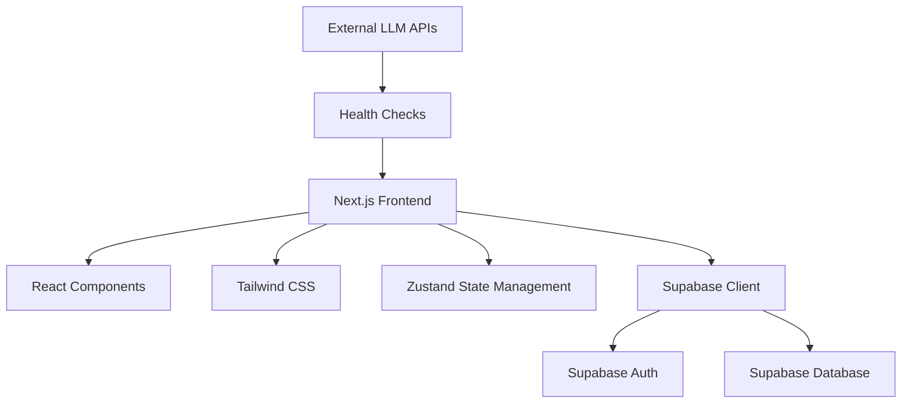
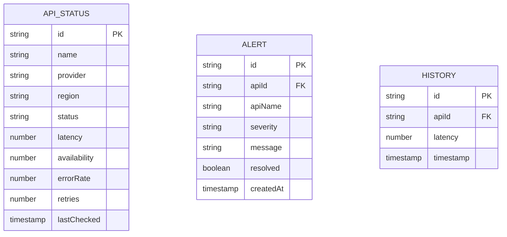

## 1. Architecture Design
本项目采用现代 React + Next.js 架构，使用 Supabase 作为后端服务。



## 2. Technology Description
- **Frontend**: React@18 + Next.js@14 + Tailwind CSS@4
- **Initialization Tool**: Next.js
- **Backend**: Supabase
- **Database**: Supabase (PostgreSQL)
- **State Management**: Zustand@5
- **Charts**: Recharts
- **Icons**: Lucide React

## 3. Route Definitions
| Route | Purpose |
|-------|---------|
| / | 主 Dashboard 页面，包含所有监控功能 |

## 4. Data Model

### 4.1 Data Model Definition


### 4.2 Core Types
```typescript
interface ApiStatus {
  id: string;
  name: string;
  provider: string;
  region: 'us' | 'cn';
  status: 'online' | 'degraded' | 'offline';
  latency: number;
  availability: number;
  errorRate: number;
  retries: number;
  lastChecked: Date;
}

interface Alert {
  id: string;
  apiId: string;
  apiName: string;
  severity: 'critical' | 'high' | 'medium' | 'low';
  message: string;
  resolved: boolean;
  createdAt: Date;
}

interface HistoryPoint {
  id: string;
  apiId: string;
  latency: number;
  timestamp: Date;
}
```
