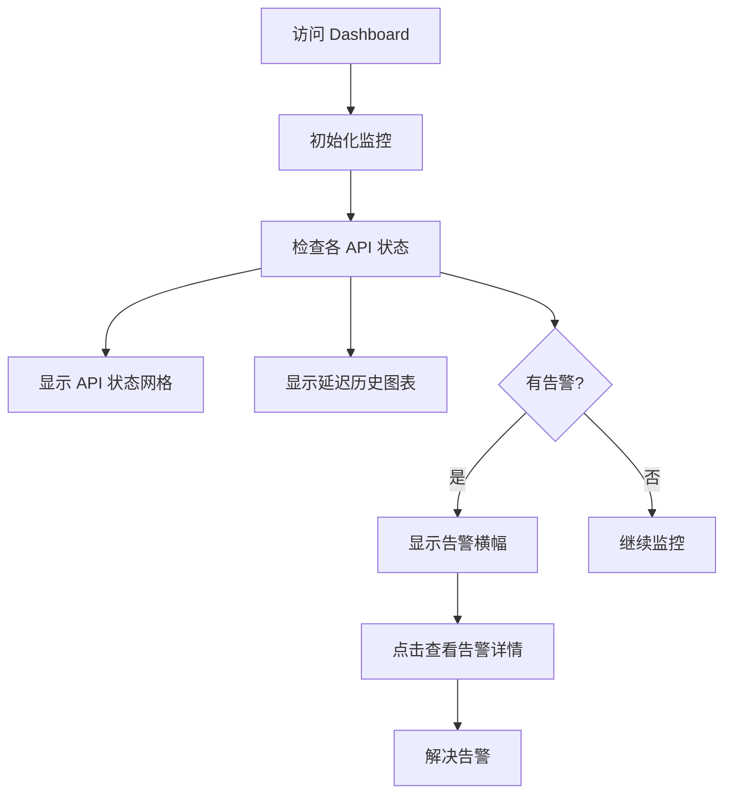

## 1. Product Overview
LLM API Sentinel 是一个全球 AI API 监控系统，用于实时监控多个 LLM 服务提供商的 API 可用性、延迟和错误率。
- 主要用途：帮助开发者和企业监控其依赖的 AI 服务状态，及时发现和响应服务中断或性能问题
- 目标用户：AI 应用开发者、DevOps 工程师、产品经理

## 2. Core Features

### 2.1 Feature Module
1. **Dashboard 主页**：API 状态概览、告警横幅、延迟历史图表
2. **API 配置面板**：自定义 API 端点和监控设置
3. **多语言支持**：支持 16 种语言切换
4. **深色/浅色主题**：自适应系统主题，支持手动切换

### 2.3 Page Details
| Page Name | Module Name | Feature description |
|-----------|-------------|---------------------|
| Dashboard | Header | 品牌标识、告警按钮、主题切换、语言选择、地理位置、登录 |
| Dashboard | Alerts Banner | 显示活跃告警数量和简要信息 |
| Dashboard | API Status Grid | 按区域分组显示各 API 状态、延迟、可用性、错误率 |
| Dashboard | Latency History Chart | 可视化显示各 API 延迟历史趋势 |
| Dashboard | API Config Panel | 允许用户自定义 API 检查配置 |

## 3. Core Process
用户访问 Dashboard → 系统自动检查各 API 状态 → 显示实时监控数据 → 用户可以查看历史图表、配置监控、切换语言和主题 → 收到告警时可以查看详情并解决问题。

## 4. User Interface Design
### 4.1 Design Style
- **设计风格**：参考 Apple 官网的极简主义设计
- **主色调**：纯净的白色/深色背景，配以柔和的中性灰作为辅助色，极少量的彩色用于状态指示
- **按钮风格**：简洁的圆角按钮，悬停时有微妙的背景变化
- **字体**：使用 SF Pro 风格的现代无衬线字体，强调清晰的层次
- **布局**：大量留白，卡片式设计，内容居中对齐
- **图标**：简洁线性图标，与 Apple 设计语言一致
- **动画**：平滑的过渡效果，优雅的入场动画

### 4.2 Page Design Overview
| Page Name | Module Name | UI Elements |
|-----------|-------------|-------------|
| Dashboard | Header | 左对齐品牌标识，右对齐控制按钮，大量留白，纤细的边框分隔 |
| Dashboard | Hero Section | 简洁的标题和副标题，居中对齐，充足的上下间距 |
| Dashboard | API Cards | 白色卡片，极细边框，悬停时微妙上浮，状态指示器在右上角 |
| Dashboard | Chart | 浅灰色背景，简洁的线条图表，无过度装饰 |

### 4.3 Responsiveness
- Desktop-first 设计，适配从移动端到大屏桌面
- 移动端：单列布局，简化控件
- 平板：双列网格
- 桌面：三到四列网格

### 4.4 交互细节
- 卡片悬停：轻微上浮 + 阴影增强
- 状态变化：平滑的颜色过渡
- 页面加载：内容淡入效果
- 按钮点击：轻微的缩放反馈
