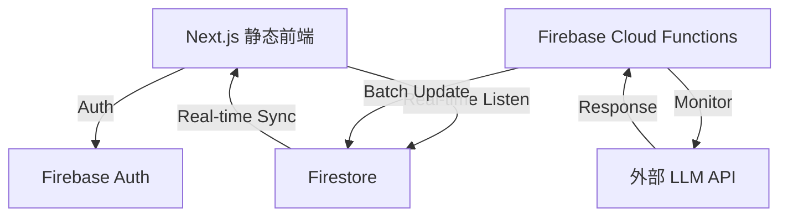

# 架构概览

LLM API Sentinel 采用**静态前端 + Firebase 后端**架构，无需自定义 API 路由。

## 技术栈
- **框架**：Next.js 14.2.13 (App Router, 静态导出)
- **后端**：Firebase Cloud Functions (无服务器)
- **数据库**：Firebase Firestore
- **身份验证**：Firebase Authentication (Google OAuth)
- **样式**：Tailwind CSS 4.1.11
- **图表**：Recharts 3.8.0
- **图标**：Lucide React
- **状态管理**：Zustand 5.0.12
- **时间处理**：date-fns 4.1.0

## 系统架构图

## 前端架构
- **组件结构**：
  - DashboardHeader：品牌信息、用户认证、告警通知、主题切换
  - ApiStatusGrid：API 状态卡片网格，显示在线/离线/延迟状态
  - StatusGrid：增强版状态网格，支持供应商分组
  - LatencyHistoryChart：历史延迟趋势图表，使用 Recharts
  - AlertsDropdown：活跃告警下拉菜单，支持告警解决
  - ApiConfig：API 配置界面，支持自定义检查
  - ThemeProvider：深色/浅色主题管理

- **数据管理**：
  - useDashboardData：核心数据钩子，处理状态获取、历史数据、告警管理
  - useApiMonitor：从 Firestore 直接读取状态，增强的告警检查
  - Zustand 状态管理（api、auth、alerts、geo、error）
  - Firebase Firestore 实时监听
  - 地理位置信息本地缓存（24小时）
  - 多层缓存系统（内存 + localStorage + sessionStorage）

## 后端架构
- **Firebase Cloud Functions**：
  - 每5分钟执行一次后台监控任务
  - 并发请求限制（MAX_CONCURRENT = 5）
  - API 检查重试机制（MAX_RETRIES = 2, RETRY_DELAY = 1000ms）
  - 批量写入 Firestore 以优化性能

- **监控逻辑**：
  - 检查美国和中国的主流 LLM API
  - 批量写入 Firestore 以优化性能
  - 智能告警规则，避免重复告警
  - 基于延迟值的动态告警严重程度评估
  - 缓存策略优化，减少重复请求
  - 增强指标计算（错误率、可用性、正常运行时间等）

## 数据流
1. 客户端通过 Firebase Auth 进行用户认证
2. 认证用户可以手动触发 API 检查
3. Cloud Functions 每5分钟自动执行 API 检查
4. 检查结果批量写入 Firestore
5. 客户端通过实时监听从 Firestore 获取最新状态（无需 API 路由）
6. 系统根据检查结果生成智能告警
7. 认证用户可以查看和解决告警

## 部署优势
- **前端**：静态导出，可部署到任何静态托管服务（EdgeOne Pages、Vercel、Firebase Hosting）
- **后端**：Cloud Functions 自动扩展，无需服务器管理
- **数据**：Firestore 实时同步，无需轮询
