# 架构设计文档

## 1. 架构概览

LLM API Sentinel 采用**静态前端 + Firebase 后端**架构，无需自定义 API 路由。前端直接与 Firebase Firestore 进行实时数据同步，后端通过 Express 服务器执行定时监控任务。

### 1.1 技术栈
| 类别 | 技术 | 版本 |
|-----|------|------|
| 前端框架 | Next.js 14.2.13 (App Router) | 14.2.13 |
| 后端服务器 | Express 5.2.1 | 5.2.1 |
| 数据库 | Firebase Firestore | - |
| 身份验证 | Firebase Authentication (Google OAuth) | - |
| 样式 | Tailwind CSS 4.1.11 | 4.1.11 |
| 图表 | Recharts 3.8.0 | 3.8.0 |
| 图标 | Lucide React | - |
| 状态管理 | Zustand 5.0.12 | 5.0.12 |
| 时间处理 | date-fns 4.1.0 | 4.1.0 |

### 1.2 系统架构图

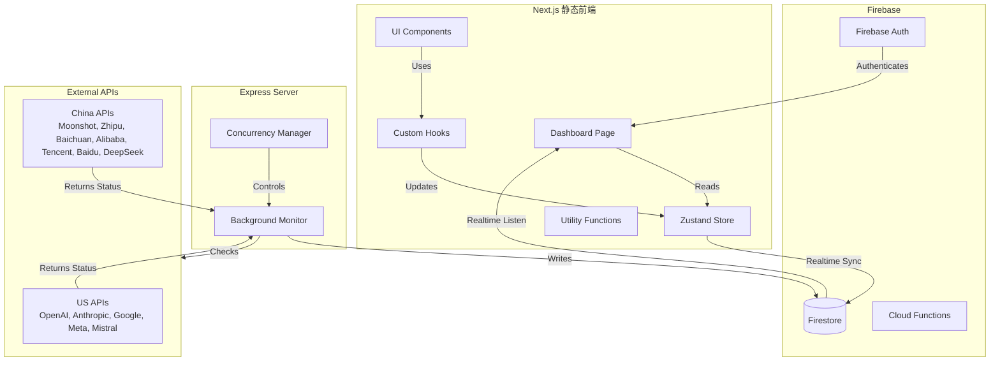

## 2. 前端架构

### 2.1 组件层级结构

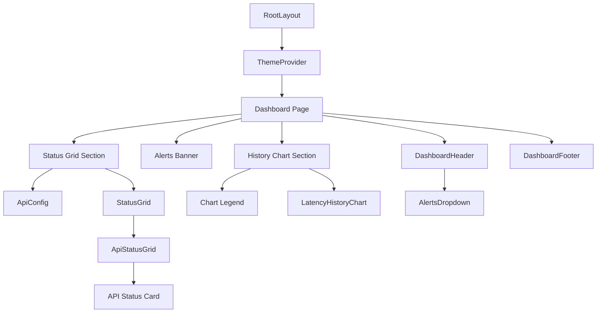

### 2.2 组件职责说明

| 组件 | 职责 | 状态依赖 |
|-----|------|---------|
| **RootLayout** | 根布局，设置主题和全局样式 | 无 |
| **ThemeProvider** | 主题管理，支持深色/浅色模式 | `theme` |
| **Dashboard** | 主页面容器，整合所有功能 | 所有状态 |
| **DashboardHeader** | 头部导航，包含品牌、告警、主题切换、用户认证 | `user`, `alerts`, `theme`, `geo` |
| **AlertsBanner** | 顶部告警横幅，显示活跃告警数量 | `alerts` |
| **StatusGrid** | API 状态网格，支持供应商分组 | `statuses` |
| **ApiStatusGrid** | API 状态卡片网格（旧版） | `statuses` |
| **ApiCard** | 单个 API 状态卡片 | `status` |
| **LatencyHistoryChart** | 延迟历史图表 | `history`, `statuses` |
| **ApiConfig** | API 配置面板 | 本地存储 |
| **AlertsDropdown** | 告警下拉菜单 | `alerts` |
| **DashboardFooter** | 页脚信息 | 无 |

### 2.3 数据管理架构

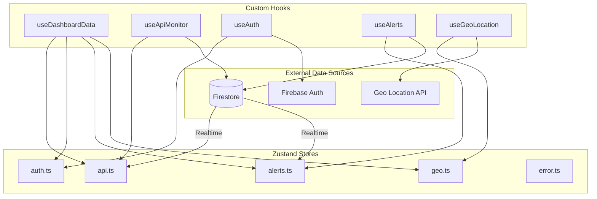

### 2.4 状态管理模块

| Store | 职责 | 持久化 |
|-----|------|--------|
| **api.ts** | 管理 API 状态和历史数据 | 部分（statuses） |
| **auth.ts** | 管理用户认证状态 | 无（从 Firebase 获取） |
| **alerts.ts** | 管理告警列表 | 无（从 Firestore 获取） |
| **geo.ts** | 管理地理位置信息 | 是 |
| **error.ts** | 管理错误和通知 | 无 |

## 3. 后端架构

### 3.1 后台监控流程

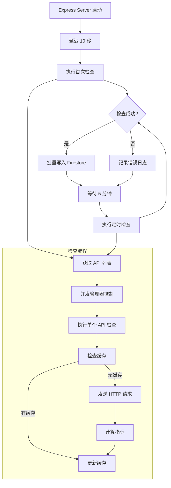

### 3.2 并发控制机制

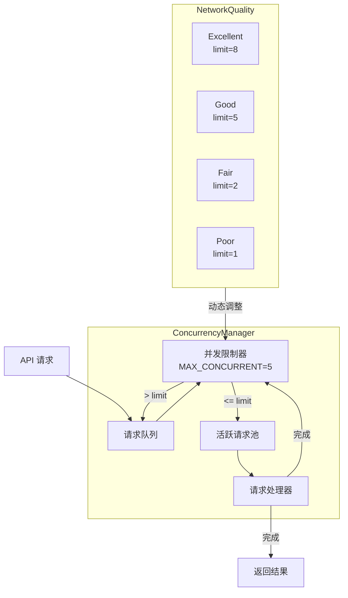

### 3.3 智能告警流程

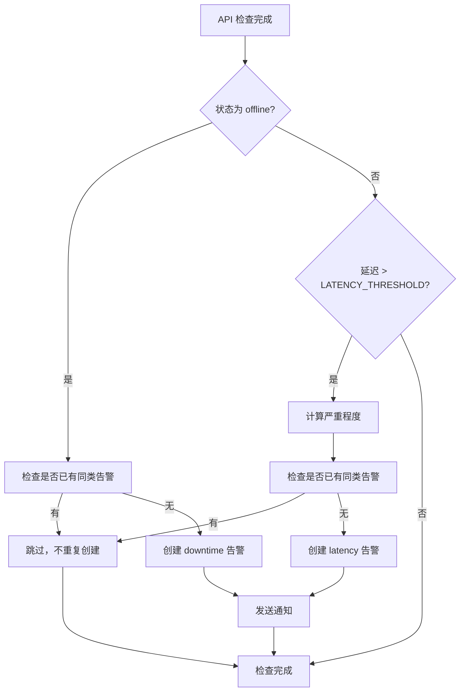

## 4. 数据流

### 4.1 实时数据同步流程

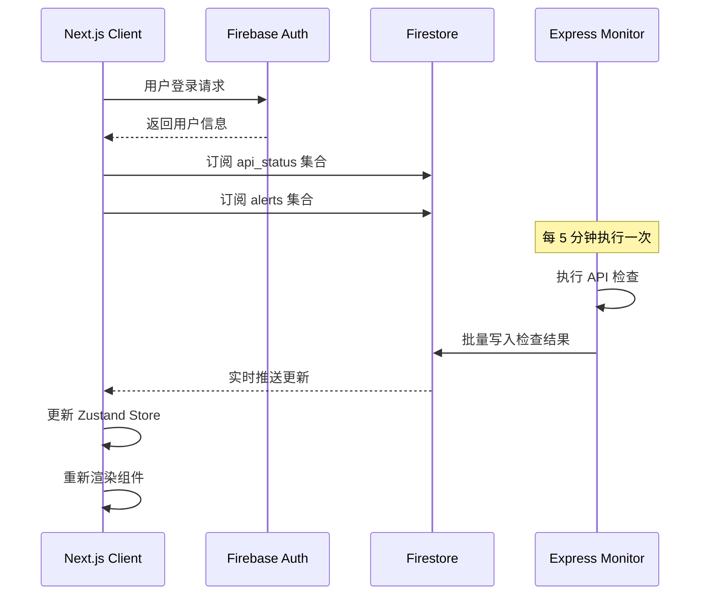

### 4.2 手动检查流程

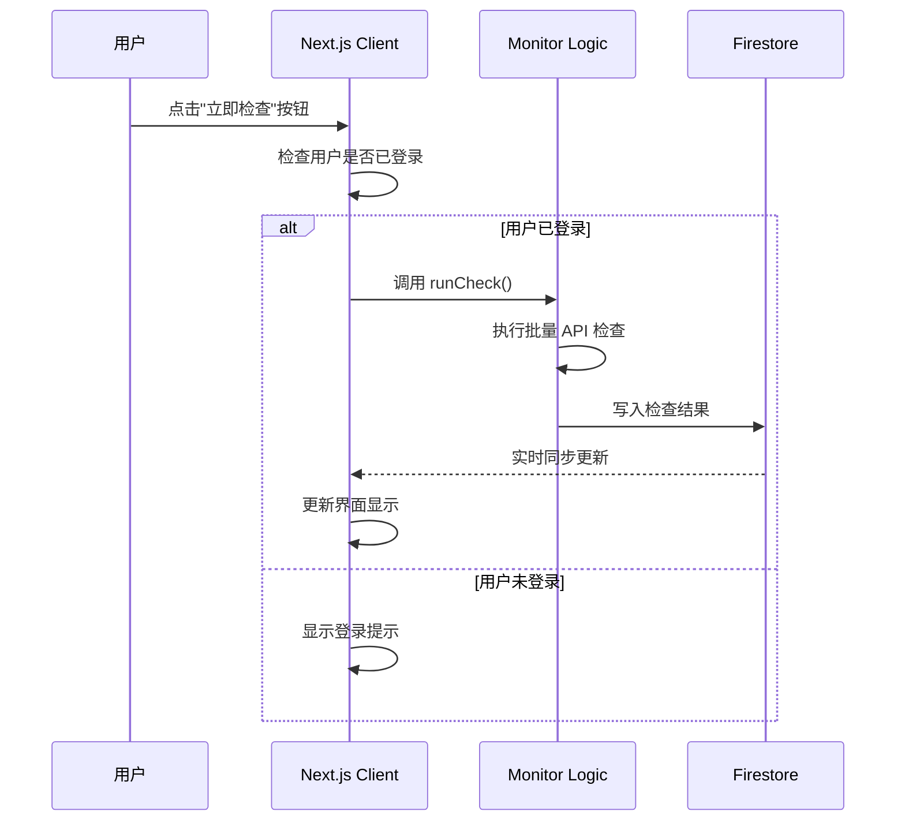

### 4.3 告警处理流程

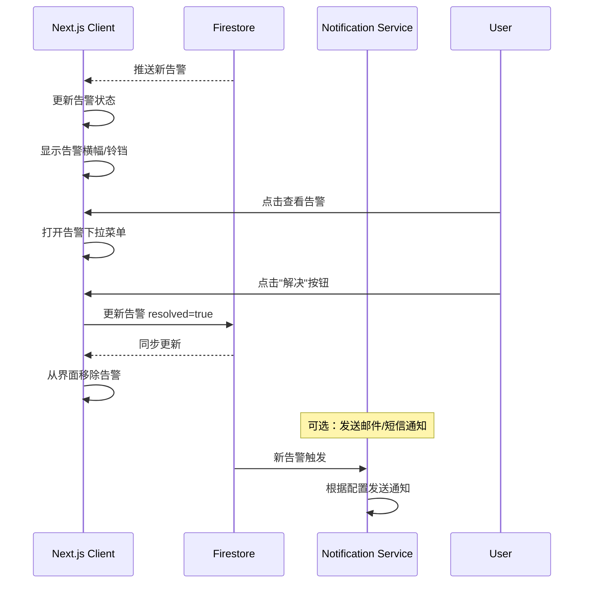

## 5. 缓存架构

### 5.1 多层缓存系统

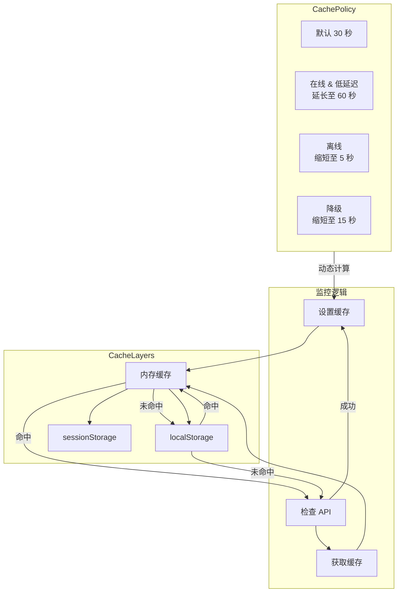

### 5.2 缓存过期策略

| 状态 | 过期时间 | 说明 |
|-----|---------|------|
| **online + latency < 100ms** | 60 秒 | 快速响应，延长缓存 |
| **online + latency 100-1000ms** | 30 秒 | 默认缓存时间 |
| **online + latency > 1000ms** | 15 秒 | 高延迟，缩短缓存 |
| **degraded** | 15 秒 | 降级状态，缩短缓存 |
| **offline** | 5 秒 | 离线状态，快速重试 |

## 6. 部署架构

### 6.1 部署组件

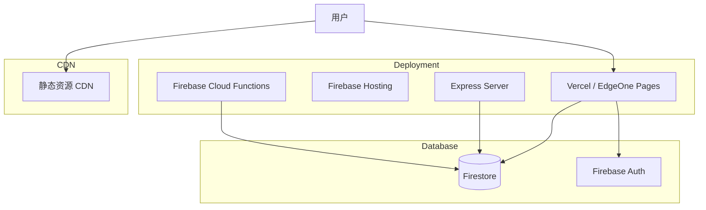

### 6.2 部署选项对比

| 选项 | 适用场景 | 优势 | 劣势 |
|-----|---------|------|------|
| **Vercel** | 纯静态前端 | 自动 SSL、全球 CDN、无缝 Next.js 集成 | 无后端支持 |
| **Firebase Hosting** | 全栈应用 | 与 Firestore/Auth 深度集成 | 部署配置较复杂 |
| **EdgeOne Pages** | 中国区部署 | 国内加速、低成本 | 功能相对简单 |
| **Express Server** | 后台任务 | 可控性强、支持定时任务 | 需要服务器维护 |

## 7. 安全架构

### 7.1 安全层级

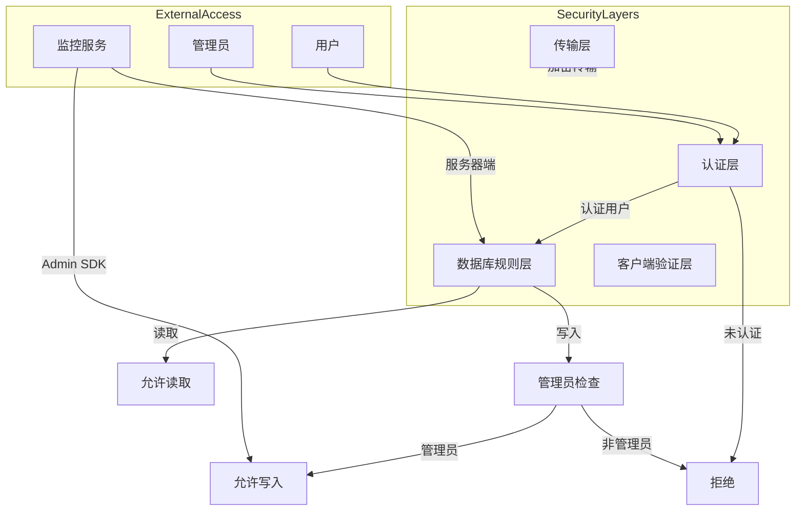

### 7.2 安全规则矩阵

| 集合 | 读取权限 | 写入权限 | 说明 |
|-----|---------|---------|------|
| `api_status` | 公开 | 管理员 | 状态信息公开可读 |
| `status_history` | 公开 | 管理员 | 历史数据公开可读 |
| `alerts` | 公开 | 管理员 | 告警信息公开可读 |
| `users` | 管理员 | 管理员 | 用户管理（可选） |

## 8. 性能优化架构

### 8.1 前端优化策略

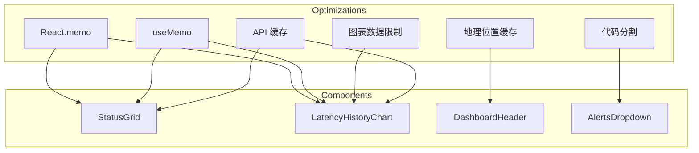

### 8.2 后端优化策略

| 优化项 | 实现方式 | 收益 |
|-----|---------|------|
| **并发控制** | 限制最大并发数为 5 | 避免请求过多被限流 |
| **重试机制** | 指数退避策略 | 提高成功率 |
| **批量写入** | Firestore 批量操作 | 减少网络往返 |
| **智能缓存** | 根据状态动态调整过期时间 | 减少不必要请求 |
| **超时控制** | 6 秒请求超时 | 防止长时间阻塞 |