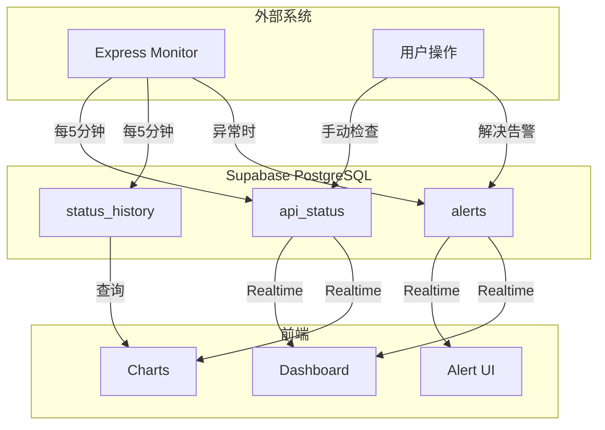
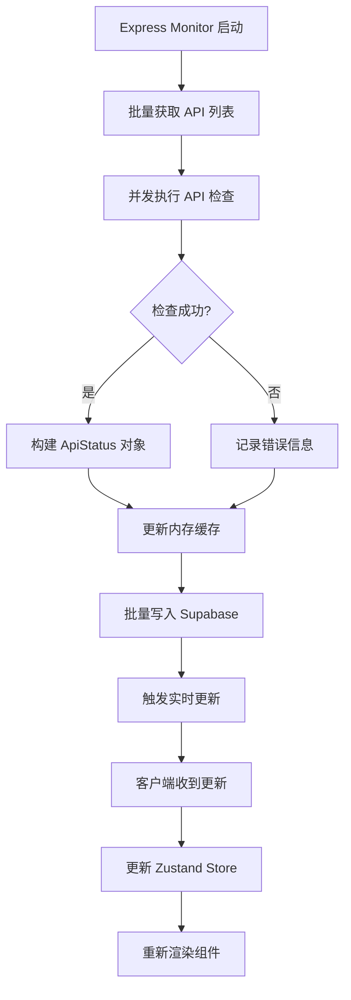
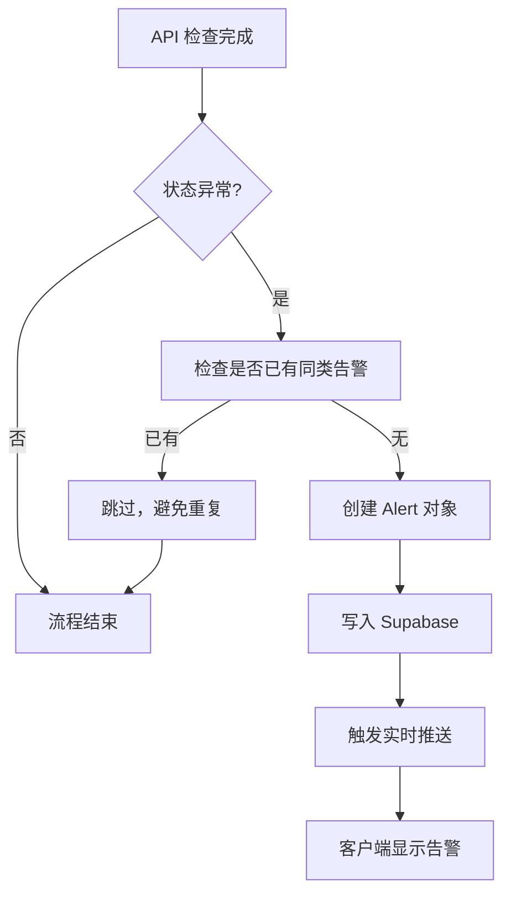
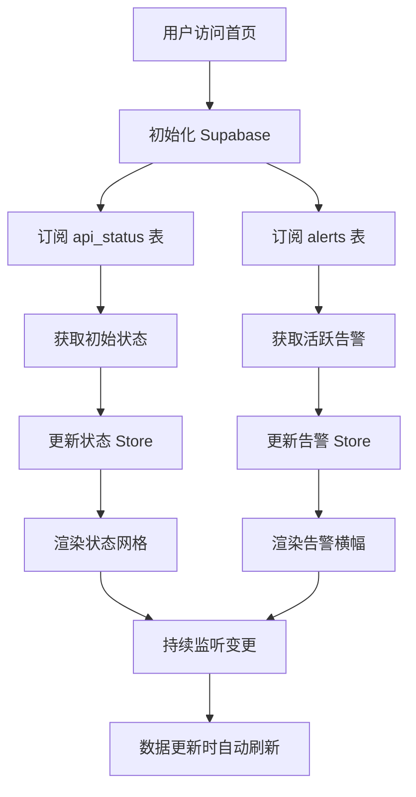
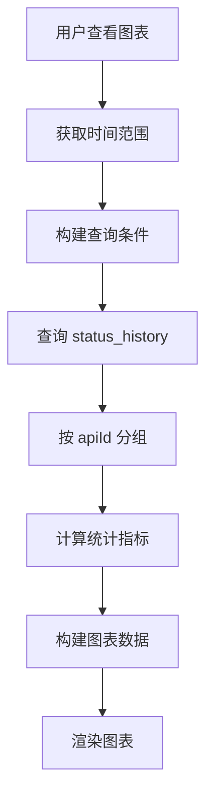
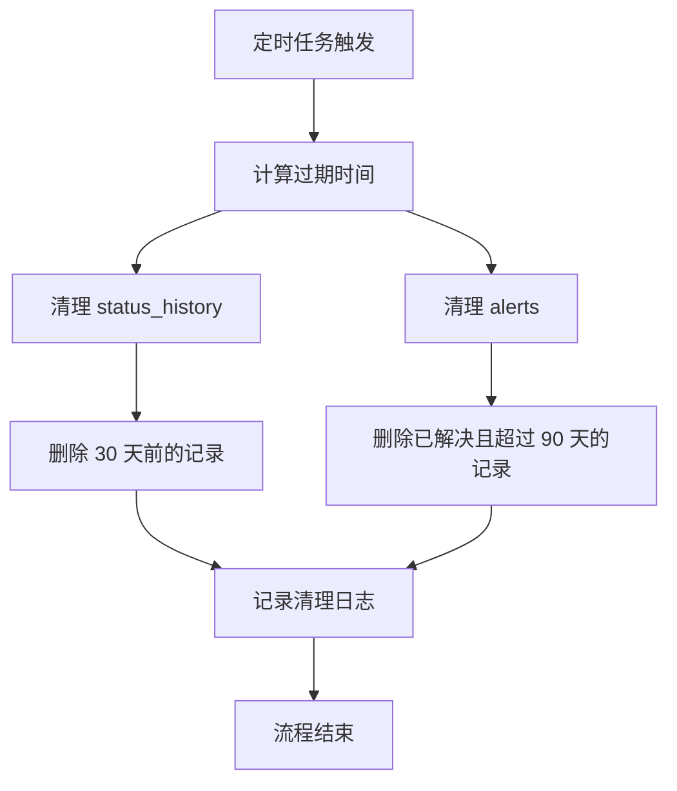
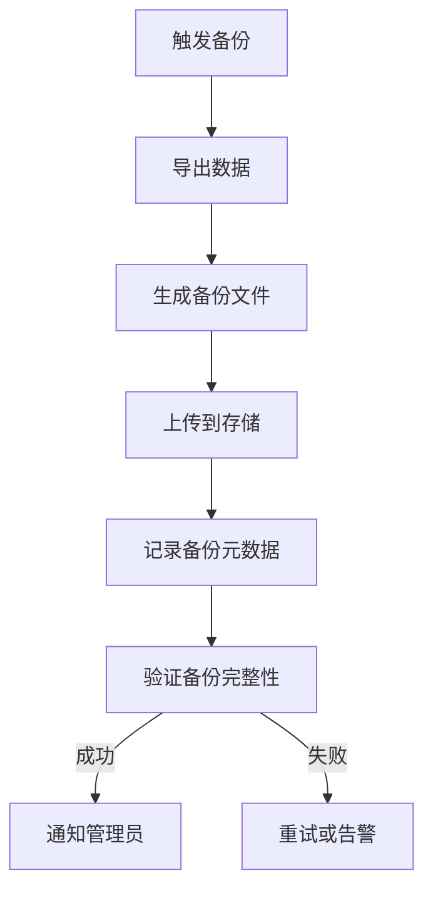
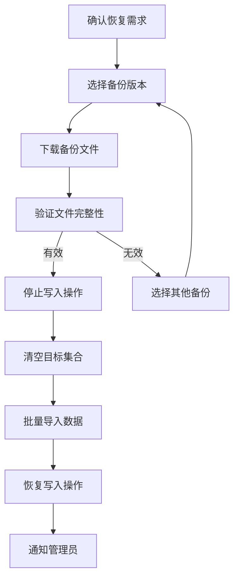
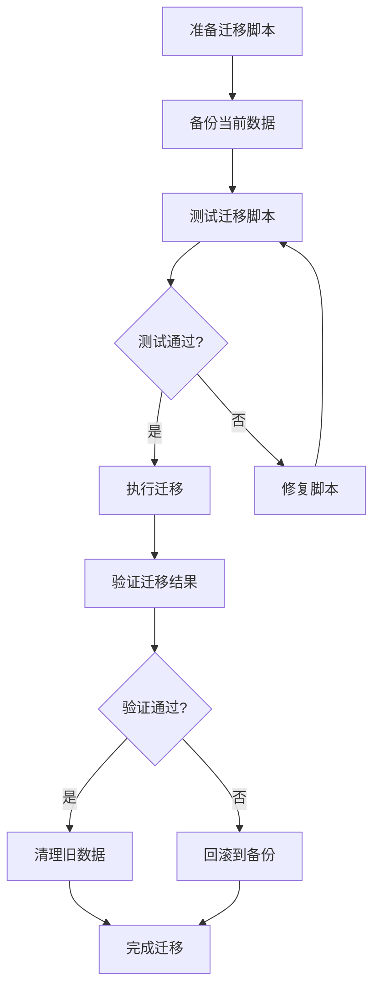

# 数据模型与安全文档

## 1. 数据模型

### 1.1 实体定义

LLM API Sentinel 使用 Supabase PostgreSQL 作为主要数据库，包含以下核心实体：

| 实体 | 描述 | 生命周期 |
|-----|------|---------|
| **ApiStatus** | API 的当前状态，包含基本信息、状态、延迟、指标等 | 实时更新 |
| **StatusHistory** | API 的历史性能数据，用于生成图表 | 持续追加 |
| **Alert** | 系统告警信息，包含告警类型、严重程度、解决状态等 | 创建→解决→保留 |

### 1.2 集合路径

| 表名 | 用途 | 读写权限 |
|---------|------|---------|
| `api_status` | 存储每个 API 的当前状态 | 所有人可读，所有人可写 |
| `status_history` | 存储 API 状态历史记录 | 所有人可读，所有人可写 |
| `alerts` | 存储系统告警信息 | 所有人可读写 |

### 1.3 数据结构

#### ApiStatus
```typescript
interface ApiStatus {
  id: string;                    // API 唯一标识，格式: {provider}-{model}
  name: string;                  // 显示名称，如 "GPT-4o"
  provider: string;              // 提供商名称，如 "OpenAI"
  url: string;                   // 检查 URL
  status: 'online' | 'offline' | 'degraded';  // 状态
  latency: number;               // 延迟(ms)
  lastChecked: string;           // 最后检查时间 (ISO 字符串)
  error?: string;                // 错误信息
  retries?: number;              // 重试次数
  errorRate?: number;            // 错误率(%)
  availability?: number;         // 可用性(%)
  uptime?: number;               // 正常运行时间(%)
  averageLatency?: number;       // 平均延迟(ms)
  maxLatency?: number;           // 最大延迟(ms)
  minLatency?: number;           // 最小延迟(ms)
}
```

**字段说明**：
| 字段 | 类型 | 必填 | 说明 |
|-----|------|-----|------|
| `id` | string | 是 | 唯一标识符 |
| `name` | string | 是 | 显示名称 |
| `provider` | string | 是 | 提供商名称 |
| `url` | string | 是 | 检查端点 URL |
| `status` | enum | 是 | 状态值 |
| `latency` | number | 是 | 延迟毫秒数 |
| `lastChecked` | string | 是 | ISO 时间戳 |
| `error` | string | 否 | 错误描述 |
| `retries` | number | 否 | 重试次数 |
| `errorRate` | number | 否 | 错误率百分比 |
| `availability` | number | 否 | 可用性百分比 |
| `uptime` | number | 否 | 正常运行时间百分比 |

#### StatusHistory
```typescript
interface StatusHistory {
  id?: string;                   // 记录 ID (自动生成)
  apiId: string;                 // 关联的 API ID
  status: 'online' | 'offline' | 'degraded';  // 状态
  latency: number;               // 延迟(ms)
  timestamp: Date;               // 时间戳
  time: string;                  // 格式化时间字符串
}
```

**字段说明**：
| 字段 | 类型 | 必填 | 说明 |
|-----|------|-----|------|
| `id` | string | 否 | 自动生成 |
| `apiId` | string | 是 | 关联 API |
| `status` | enum | 是 | 状态值 |
| `latency` | number | 是 | 延迟毫秒数 |
| `timestamp` | Date | 是 | 时间戳 |
| `time` | string | 是 | 格式化时间 |

#### Alert
```typescript
interface Alert {
  id: string;                    // 告警 ID
  apiId: string;                 // 关联的 API ID
  apiName: string;               // API 显示名称
  type: 'downtime' | 'latency' | 'error';  // 告警类型
  severity: 'low' | 'medium' | 'high' | 'critical';  // 严重程度
  message: string;               // 告警消息
  timestamp: Date | unknown;     // 时间戳
  resolved: boolean;             // 是否已解决
  error?: string;                // 错误信息
  retries?: number;              // 重试次数
  latency?: number;              // 延迟值(仅 latency 类型)
  resolvedAt?: Date;             // 解决时间
  resolvedBy?: string;           // 解决人(用户ID或邮箱)
}
```

**字段说明**：
| 字段 | 类型 | 必填 | 说明 |
|-----|------|-----|------|
| `id` | string | 是 | 唯一标识符 |
| `apiId` | string | 是 | 关联 API |
| `apiName` | string | 是 | API 名称 |
| `type` | enum | 是 | 告警类型 |
| `severity` | enum | 是 | 严重程度 |
| `message` | string | 是 | 告警消息 |
| `timestamp` | Date | 是 | 创建时间 |
| `resolved` | boolean | 是 | 是否已解决 |
| `resolvedAt` | Date | 否 | 解决时间 |
| `resolvedBy` | string | 否 | 解决人 |

## 2. 数据流转

### 2.1 数据流向图



### 2.2 数据写入流程

#### API 状态更新流程


#### 告警创建流程


### 2.3 数据读取流程

#### 首页数据加载流程


#### 历史数据查询流程


## 3. 索引策略

### 3.1 索引需求分析

| 查询场景 | 所需字段 | 排序 | 索引类型 |
|---------|---------|-----|---------|
| 获取所有 API 状态 | 无 | 无 | 集合扫描(小数据集) |
| 获取特定 API 状态 | `id` | 无 | 主键索引(默认) |
| 获取活跃告警 | `resolved` | `timestamp DESC` | 复合索引 |
| 查询历史数据 | `apiId`, `timestamp` | `timestamp DESC` | 复合索引 |
| 按提供商筛选 | `provider` | 无 | 单字段索引 |

### 3.2 推荐索引

#### 告警集合索引
```javascript
// 活跃告警查询
// 索引字段: resolved, timestamp DESC
{
  "fields": [
    {"fieldPath": "resolved", "mode": "ASCENDING"},
    {"fieldPath": "timestamp", "mode": "DESCENDING"}
  ]
}
```

**用途**：快速获取未解决的告警，按时间倒序排列

#### 历史数据索引
```javascript
// 历史数据查询
// 索引字段: apiId, timestamp DESC
{
  "fields": [
    {"fieldPath": "apiId", "mode": "ASCENDING"},
    {"fieldPath": "timestamp", "mode": "DESCENDING"}
  ]
}
```

**用途**：按 API 查询历史记录，支持时间范围筛选

#### API 状态索引
```javascript
// 按提供商筛选
// 索引字段: provider
{
  "fields": [
    {"fieldPath": "provider", "mode": "ASCENDING"}
  ]
}
```

**用途**：按提供商分组显示 API 状态

### 3.3 索引管理

| 索引 | 状态 | 优先级 |
|-----|------|--------|
| `api_status/provider` | 推荐 | 中 |
| `status_history/apiId+timestamp` | 必须 | 高 |
| `alerts/resolved+timestamp` | 必须 | 高 |

## 4. 数据生命周期管理

### 4.1 数据保留策略

| 数据类型 | 保留期限 | 清理策略 |
|---------|---------|---------|
| **ApiStatus** | 永久 | 不清理，持续更新 |
| **StatusHistory** | 30 天 | 定时清理过期记录 |
| **Alerts** | 90 天 | 解决后保留 90 天 |

### 4.2 清理流程



### 4.3 清理脚本示例

```typescript
async function cleanupOldData() {
  const thirtyDaysAgo = new Date();
  thirtyDaysAgo.setDate(thirtyDaysAgo.getDate() - 30);
  
  const ninetyDaysAgo = new Date();
  ninetyDaysAgo.setDate(ninetyDaysAgo.getDate() - 90);
  
  // 清理历史数据
  const historyQuery = db.collection('status_history')
    .where('timestamp', '<', thirtyDaysAgo);
  
  const historySnapshot = await historyQuery.get();
  const historyBatch = db.batch();
  
  historySnapshot.docs.forEach(doc => {
    historyBatch.delete(doc.ref);
  });
  
  await historyBatch.commit();
  
  // 清理已解决的告警
  const alertsQuery = db.collection('alerts')
    .where('resolved', '==', true)
    .where('resolvedAt', '<', ninetyDaysAgo);
  
  const alertsSnapshot = await alertsQuery.get();
  const alertsBatch = db.batch();
  
  alertsSnapshot.docs.forEach(doc => {
    alertsBatch.delete(doc.ref);
  });
  
  await alertsBatch.commit();
  
  console.log('[Cleanup] Old data cleaned successfully');
}
```

## 5. 备份策略

### 5.1 备份类型

| 类型 | 频率 | 保留 | 用途 |
|-----|------|-----|------|
| **自动备份** | 每日 | 7 天 | 日常恢复 |
| **手动备份** | 按需 | 永久 | 重大变更前 |
| **导出备份** | 每周 | 30 天 | 合规存档 |

### 5.2 备份流程



### 5.3 恢复流程



## 6. 安全规则

### 6.1 Supabase RLS 策略

```sql
-- 启用 RLS
ALTER TABLE api_status ENABLE ROW LEVEL SECURITY;
ALTER TABLE status_history ENABLE ROW LEVEL SECURITY;
ALTER TABLE alerts ENABLE ROW LEVEL SECURITY;
ALTER TABLE user_profiles ENABLE ROW LEVEL SECURITY;

-- API Status 表：所有人可读写
CREATE POLICY "api_status_select_all" ON api_status FOR SELECT USING (true);
CREATE POLICY "api_status_insert_all" ON api_status FOR INSERT WITH CHECK (true);
CREATE POLICY "api_status_update_all" ON api_status FOR UPDATE USING (true);

-- Status History 表：所有人可读写
CREATE POLICY "status_history_select_all" ON status_history FOR SELECT USING (true);
CREATE POLICY "status_history_insert_all" ON status_history FOR INSERT WITH CHECK (true);

-- Alerts 表：所有人可读写
CREATE POLICY "alerts_select_all" ON alerts FOR SELECT USING (true);
CREATE POLICY "alerts_insert_all" ON alerts FOR INSERT WITH CHECK (true);
CREATE POLICY "alerts_update_resolve" ON alerts FOR UPDATE USING (true);

-- User Profiles 表：用户可读写自己的资料
CREATE POLICY "user_profiles_select_own" ON user_profiles FOR SELECT USING (auth.uid() = user_id);
CREATE POLICY "user_profiles_insert_own" ON user_profiles FOR INSERT WITH CHECK (auth.uid() = user_id);
CREATE POLICY "user_profiles_update_own" ON user_profiles FOR UPDATE USING (auth.uid() = user_id);
```

### 6.2 安全策略说明

| 表名 | 读取权限 | 写入权限 | 说明 |
|-----|---------|---------|------|
| `api_status` | 公开 | 公开 | API 状态信息公开 |
| `status_history` | 公开 | 公开 | 历史数据公开 |
| `alerts` | 公开 | 公开 | 告警信息可被所有人管理 |
| `user_profiles` | 仅本人 | 仅本人 | 用户资料仅本人可访问 |

### 6.3 数据验证规则

#### ApiStatus 数据验证
```sql
-- 创建触发器验证数据格式
CREATE OR REPLACE FUNCTION validate_api_status()
RETURNS TRIGGER AS $$
BEGIN
  IF NEW.id IS NULL OR NEW.id = '' THEN
    RAISE EXCEPTION 'API ID is required';
  END IF;
  
  IF NEW.status NOT IN ('online', 'offline', 'degraded') THEN
    RAISE EXCEPTION 'Invalid status value';
  END IF;
  
  IF NEW.latency < 0 THEN
    RAISE EXCEPTION 'Latency cannot be negative';
  END IF;
  
  RETURN NEW;
END;
$$ LANGUAGE plpgsql;

CREATE TRIGGER api_status_validation
  BEFORE INSERT OR UPDATE ON api_status
  FOR EACH ROW EXECUTE FUNCTION validate_api_status();
```

#### Alert 数据验证
```sql
CREATE OR REPLACE FUNCTION validate_alert()
RETURNS TRIGGER AS $$
BEGIN
  IF NEW.type NOT IN ('downtime', 'latency', 'error') THEN
    RAISE EXCEPTION 'Invalid alert type';
  END IF;
  
  IF NEW.severity NOT IN ('low', 'medium', 'high', 'critical') THEN
    RAISE EXCEPTION 'Invalid severity value';
  END IF;
  
  RETURN NEW;
END;
$$ LANGUAGE plpgsql;

CREATE TRIGGER alert_validation
  BEFORE INSERT OR UPDATE ON alerts
  FOR EACH ROW EXECUTE FUNCTION validate_alert();
```

## 7. 数据一致性

### 7.1 事务保证

**批量写入事务**：
```typescript
async function updateStatuses(results: ApiStatus[]) {
  const batch = db.batch();
  
  for (const result of results) {
    const statusRef = db.collection('api_status').doc(result.id);
    batch.set(statusRef, result);
    
    const historyRef = db.collection('status_history').doc();
    batch.set(historyRef, {
      apiId: result.id,
      status: result.status,
      latency: result.latency,
      timestamp: FieldValue.serverTimestamp(),
      time: new Date().toLocaleTimeString()
    });
  }
  
  await batch.commit();
}
```

### 7.2 一致性保证

| 保证类型 | 实现方式 |
|-----|---------|
| **原子性** | Supabase 批量操作保证 |
| **隔离性** | PostgreSQL 内置事务支持 |
| **持久性** | PostgreSQL WAL 自动持久化 |

## 8. 数据迁移

### 8.1 迁移流程



### 8.2 迁移注意事项

- 迁移前必须备份数据
- 迁移期间暂停写入操作
- 验证迁移后数据完整性
- 保留回滚方案

## 9. 性能优化

### 9.1 查询优化

| 优化项 | 实现方式 |
|-----|---------|
| **限制数据量** | 使用 `limit()` 限制返回数量 |
| **时间范围筛选** | 使用 `where()` 限制时间范围 |
| **复合索引** | 创建适当的复合索引 |
| **批量读取** | 使用 `getAll()` 批量获取文档 |

### 9.2 写入优化

| 优化项 | 实现方式 |
|-----|---------|
| **批量写入** | 使用 Batch 操作 |
| **减少写入频率** | 聚合更新而非单次更新 |
| **离线支持** | 使用 Supabase 离线模式 |

### 9.3 缓存策略

| 缓存层 | 数据类型 | 过期时间 |
|-----|---------|---------|
| **内存缓存** | API 状态 | 30 秒 |
| **LocalStorage** | 用户配置 | 永久 |
| **SessionStorage** | 会话数据 | 会话结束 |