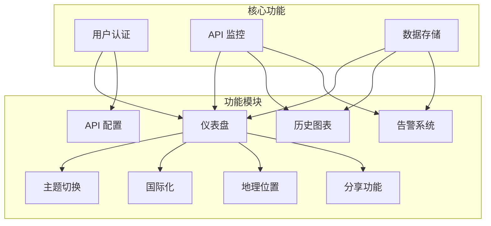
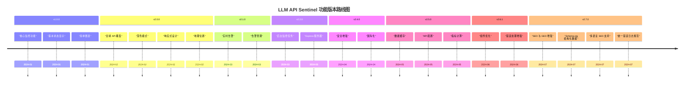
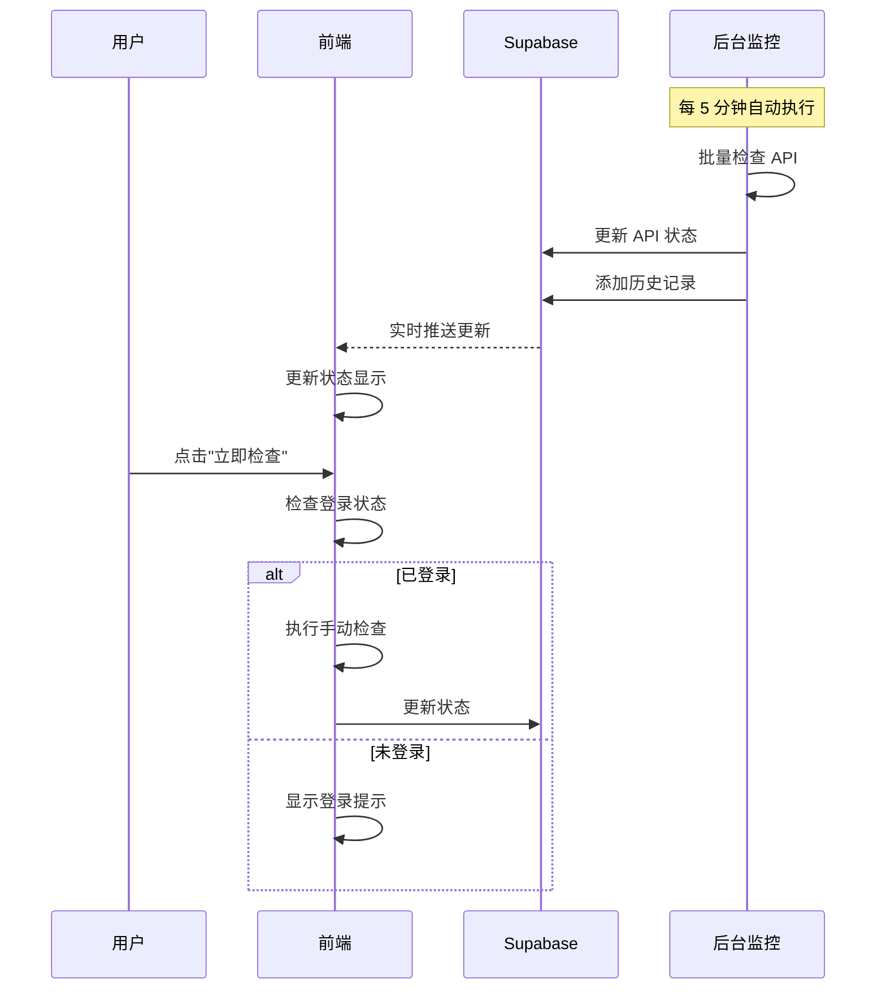
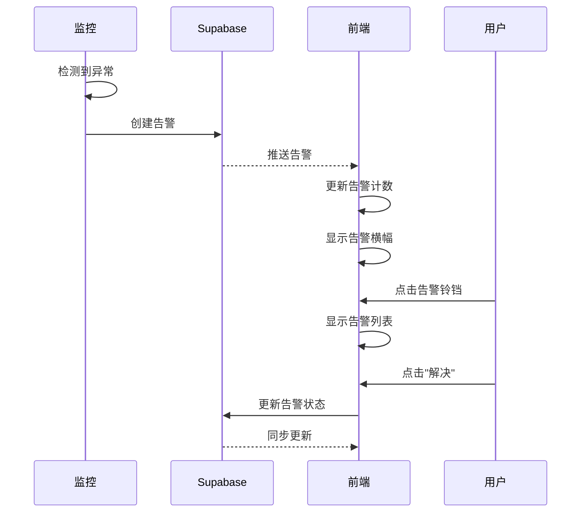
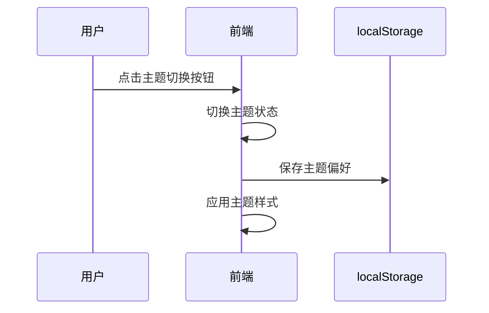

# 功能规格文档

## 1. 功能总览

LLM API Sentinel 是一个全球主流大模型 API 实时监控系统，提供以下核心功能模块：

| 功能模块 | 状态 | 优先级 |
|---------|------|--------|
| **全球 API 监控** | 已实现 | 高 |
| **历史数据可视化** | 已实现 | 高 |
| **智能告警系统** | 已实现 | 高 |
| **用户认证** | 已实现 | 高 |
| **主题切换** | 已实现 | 中 |
| **API 配置管理** | 已实现 | 中 |
| **国际化支持** | 已实现 | 中 |
| **地理位置检测** | 已实现 | 低 |
| **分享功能** | 已实现 | 中 |

## 2. 功能详细规格

### 2.1 全球 API 监控

**功能描述**：实时监控全球主流 AI 供应商的 API 状态和延迟

**监控范围**（共 29 个 API，硬编码于 `app/constants/index.ts` 的 `DEFAULT_APIS`）：

| 区域 | API 名称 | Provider | 状态 |
|-----|---------|----------|------|
| 美国 | GPT-4o | OpenAI | ✅ |
| 美国 | Claude 3.5 | Anthropic | ✅ |
| 美国 | Gemini 1.5 | Google | ✅ |
| 美国 | Llama 3 (Groq) | Meta | ✅ |
| 美国 | Mistral Large | Mistral | ✅ |
| 美国 | Grok (xAI) | xAI | ✅ |
| 美国 | Command R (Cohere) | Cohere | ✅ |
| 美国 | Sonar (Perplexity) | Perplexity | ✅ |
| 美国 | Llama (Together) | Together AI | ✅ |
| 美国 | Replicate | Replicate | ✅ |
| 美国 | Stability AI | Stability AI | ✅ |
| 美国 | Hugging Face | HuggingFace | ✅ |
| 美国 | OpenRouter | OpenRouter | ✅ |
| 美国 | Fireworks AI | Fireworks | ✅ |
| 美国 | NVIDIA NIM | NVIDIA | ✅ |
| 美国 | AI21 Labs | AI21 | ✅ |
| 中国 | Kimi (Moonshot) | Moonshot | ✅ |
| 中国 | GLM-4 (Zhipu) | ZhipuAI | ✅ |
| 中国 | Baichuan 2 | Baichuan | ✅ |
| 中国 | Qwen Max (Ali) | Alibaba | ✅ |
| 中国 | Hunyuan (Tencent) | Tencent | ✅ |
| 中国 | Ernie 4.0 (Baidu) | Baidu | ✅ |
| 中国 | DeepSeek V3 | DeepSeek | ✅ |
| 中国 | MiniMax | MiniMax | ✅ |
| 中国 | Spark (iFlytek) | iFlytek | ✅ |
| 中国 | Doubao (Volcano) | ByteDance | ✅ |
| 中国 | Yi (01.AI) | 01.AI | ✅ |
| 中国 | SiliconFlow | SiliconFlow | ✅ |
| 中国 | StepFun | StepFun | ✅ |

**监控指标**：
- **状态**：online / offline / degraded
- **延迟**：毫秒级响应时间
- **错误率**：最近一段时间的错误百分比
- **可用性**：API 可用时间百分比
- **正常运行时间**：累计正常运行时间

**监控频率**：
- 后台自动检查：每 5 分钟
- 手动检查：用户可随时触发

### 2.2 历史数据可视化

**功能描述**：使用交互式图表展示 API 性能历史趋势

**图表类型**：
- **面积图**：展示延迟随时间变化趋势
- **数据点限制**：本地历史最多保留 100 条记录

**交互功能**：
- 悬停显示详细信息
- 图例显示 API 颜色标识（前 8 个 API）
- 动态导入：图表组件使用 next/dynamic 延迟加载，减少首屏 bundle
- 加载时显示 ChartSkeleton 骨架屏
- 服务端渲染禁用（SSR: false）

**时间范围选择器**：
- 最近 1 小时
- 最近 6 小时
- 最近 24 小时

**性能优化**：
- 使用 useMemo 缓存图表数据计算
- 使用 Map 进行 O(1) 时间复杂度的数据聚合
- Recharts 库渲染

### 2.3 智能告警系统

**功能描述**：自动检测 API 异常并生成告警通知

**告警类型**：

| 类型 | 触发条件 | 严重程度 |
|-----|---------|---------|
| **宕机告警** | API 状态为 offline | high |
| **延迟告警** | 延迟 > 1500ms (LATENCY_THRESHOLD) | low/medium/high |
| **降级状态** | 延迟 > 1000ms (DEGRADED_THRESHOLD) 但仍在线 | - (状态标记，非告警) |

**延迟告警严重程度分级**：
| 延迟范围 | 严重程度 |
|---------|---------|
| 1500ms - 2250ms | low |
| 2250ms - 3000ms | medium |
| > 3000ms | high |

**告警规则**：
- 同一 API 的同一类型未解决告警不会重复创建
- 宕机告警严重程度为 high
- 告警去重检查：按 api_id + type + resolved=false 判断
- 服务端和前端都会执行告警检查（双重保障）

**告警操作**：
- 查看活跃告警列表
- 标记告警为已解决
- 自动清理已解决超过 90 天的告警

### 2.4 用户认证

**功能描述**：使用 Google OAuth 进行用户身份验证

**认证流程**：
1. 用户点击登录按钮
2. 跳转到 Google 认证页面
3. 用户授权后返回应用（auth/callback）
4. Supabase Auth 管理会话
5. 自动创建 user_profiles 记录（触发器）

**权限控制**：
- 公开数据：所有用户（包括匿名用户）可查看 API 状态
- 手动检查：需要登录才能执行
- 写入操作：认证用户可写入（RLS 策略）
- 后台服务：使用 service_role 密钥绕过 RLS

**会话管理**：
- 使用 Supabase Auth 管理会话
- 自动刷新令牌
- 登录状态持久化

### 2.5 主题切换

**功能描述**：深色/浅色双主题（基于 next-themes，`attribute="class"`），支持系统/深/浅切换，顶栏提供主题切换按钮

**主题模式**：
- **默认深度**：`:root` 默认深色主题
- **更深一档**：`.dark` 类在 `<html>` 上叠加更深一档深色

**切换方式**：
- 点击头部主题切换按钮
- 自动检测系统主题偏好
- 主题偏好持久化到本地存储

### 2.6 API 配置管理

**功能描述**：允许用户自定义 API 检查配置

**配置项**：
- 添加自定义 API 端点
- 删除已有 API
- 修改检查 URL
- 重置为默认配置

**配置持久化**：
- 配置保存到 localStorage
- 支持导出/导入配置
- 配置变更后自动生效

### 2.7 国际化支持

**功能描述**：支持多语言切换

**支持语言**：
| 语言代码 | 语言名称 | 本地名称 |
|---------|---------|--------|
| en | English | English |
| zh-cn | 简体中文 | 简体中文 |
| zh-tw | 繁体中文 | 繁體中文 |
| ar | 阿拉伯语 | العربية |
| cs | 捷克语 | Čeština |
| es | 西班牙语 | Español |
| hi | 印地语 | हिन्दी |
| id | 印度尼西亚语 | Bahasa Indonesia |
| it | 意大利语 | Italiano |
| nl | 荷兰语 | Nederlands |
| pl | 波兰语 | Polski |
| sv | 瑞典语 | Svenska |
| th | 泰语 | ไทย |
| tr | 土耳其语 | Türkçe |
| ru | 俄语 | Русский |
| vi | 越南语 | Tiếng Việt |

**翻译范围**：
- 页面标题和描述
- 按钮和菜单文本
- 状态和告警消息
- 错误提示信息

**切换方式**：
- 通过语言选择器切换
- URL 参数自动检测
- 浏览器语言自动检测

### 2.8 地理位置检测

**功能描述**：显示用户当前地理位置，增强本地化体验

**检测方式**：
- 使用 ipapi.co 服务基于 IP 检测
- 返回城市和国家信息
- 支持 Schema 校验，确保数据格式正确
- 请求超时 5 秒

**隐私设计（opt-in）**：
- 默认不获取地理位置，需用户明确授权
- 授权状态保存在 localStorage
- 支持随时撤销授权并清除数据
- 数据仅保存在本地，不上传服务器

**缓存策略**：
- 地理位置信息缓存 24 小时
- 缓存过期后重新获取
- 用户可手动刷新（需已授权）
- 失败时使用降级数据（Unknown / Global）

### 2.9 分享功能

**功能描述**：用户可将当前分析页面（含筛选、时间范围等状态）以链接形式分享给他人，复制链接时自动附带一条项目宣传文案，多个文案随机选用，提升传播性。

**触发入口**：
- 仪表盘顶栏（DashboardHeader）的「分享」按钮（`ShareButton` 组件）
- 点击后复制当前页面 URL（含 URL 查询参数）到剪贴板

**复制内容格式**：
```
<分析链接>
<随机项目宣传文案>
```
- 第一行：当前 `window.location.href`（含时间范围、语言等查询参数）
- 第二行：从宣传文案库中随机抽取一条（`share.promos` 数组，随机均匀分布）
- 两行之间以换行分隔，便于在 IM / 社交平台直接粘贴

**宣传文案（Promo Copies）**：
- 文案存放于 i18n 资源的 `share.promos` 数组（每语言可定义多条）
- 未定义某语言文案时回退至英文（en）文案
- 文案数量：英文 ≥ 4 条，中文（zh-cn / zh-tw）≥ 4 条，其余语言可选（回退 en）
- 随机算法：基于数组长度取 `Math.floor(Math.random() * length)`，保证均匀随机

**剪贴板实现**：
- 优先使用 `navigator.clipboard.writeText`（HTTPS 安全上下文）
- 失败时降级使用 `document.execCommand('copy')` 兜底
- 复制成功显示「已复制」瞬时反馈（toast / tooltip），失败给出错误提示

**交互状态**：
- 复制中：按钮 loading 态（`disabled`）
- 复制成功：`share.copied` 提示，2 秒后自动消失
- 复制失败：`share.copyFailed` 提示

**可访问性**：
- 按钮携带 `aria-label={t('share.title')}`
- 反馈文本使用 `aria-live="polite"` 区域

**依赖**：
- 依赖 Dashboard 顶栏展示（Theme / I18n 已具备）
- 文案依赖 i18n `share` 命名空间

**边界情况**：
- 非安全上下文（HTTP / file://）下 `navigator.clipboard` 不可用 → 自动降级 execCommand
- 用户拒绝剪贴板权限 → 捕获异常并提示失败

## 3. 功能依赖关系



**依赖说明**：
| 功能 | 依赖 | 说明 |
|-----|------|------|
| Dashboard | Auth, Monitor, Data | 需要认证状态、监控数据 |
| Charts | Monitor, Data | 需要历史监控数据 |
| Alerts | Monitor, Data | 需要监控结果生成告警 |
| Config | Auth | 需要登录才能修改配置 |
| Theme | Dashboard | 依赖仪表盘展示 |
| I18n | Dashboard | 依赖仪表盘展示 |
| Geo | Dashboard | 依赖仪表盘展示 |

## 4. 功能优先级

### 4.1 优先级矩阵

| 优先级 | 功能 | 原因 |
|--------|------|------|
| **P0** | API 状态监控 | 核心功能，必须正常工作 |
| **P0** | 历史数据展示 | 核心功能，用户核心需求 |
| **P0** | 告警系统 | 核心功能，及时通知异常 |
| **P1** | 用户认证 | 安全需求，保护敏感操作 |
| **P1** | 主题切换 | 用户体验，提高可用性 |
| **P2** | API 配置 | 进阶功能，部分用户需要 |
| **P2** | 国际化 | 扩展需求，多语言支持 |
| **P3** | 地理位置 | 辅助功能，增强体验 |

### 4.2 功能版本路线图



## 5. 功能交互流程

### 5.1 监控流程



### 5.2 告警处理流程



### 5.3 主题切换流程



## 6. 功能非功能需求

### 6.1 性能要求

| 指标 | 目标 | 说明 |
|-----|------|------|
| 页面加载时间 | < 2 秒 | 首屏加载 |
| API 检查延迟 | < 6 秒 | 单个 API 检查 |
| 并发检查数量 | 5 | 最大并发数 |
| 图表渲染 | < 500ms | 50 个数据点 |

### 6.2 可用性要求

| 指标 | 目标 | 说明 |
|-----|------|------|
| 监控覆盖率 | 100% | 所有配置的 API |
| 告警准确率 | > 95% | 减少误报 |
| 数据更新延迟 | < 10 秒 | 实时同步 |

### 6.3 安全要求

| 要求 | 说明 |
|-----|------|
| 数据加密 | HTTPS 传输 |
| 访问控制 | 基于角色的权限 |
| 敏感信息 | 不存储密码/Tokens |

### 6.4 兼容性要求

| 平台 | 版本 |
|-----|------|
| Chrome | 最新 2 版 |
| Firefox | 最新 2 版 |
| Safari | 最新 2 版 |
| Edge | 最新 2 版 |

## 7. 功能验收标准

### 7.1 API 监控功能

**验收标准**：
- [ ] 所有 29 个 API 都能被正确监控
- [ ] 状态显示正确（online/offline/degraded）
- [ ] 延迟显示准确（毫秒级）
- [ ] 后台每 5 分钟自动检查
- [ ] 支持手动触发检查

### 7.2 历史数据可视化

**验收标准**：
- [ ] 图表显示最近 50 个数据点
- [ ] 支持多个 API 对比显示
- [ ] 悬停显示详细信息
- [ ] 图例点击切换显示

### 7.3 智能告警系统

**验收标准**：
- [ ] API 宕机时生成告警
- [ ] 延迟过高时生成告警
- [ ] 相同类型告警不重复创建
- [ ] 支持标记告警为已解决

### 7.4 用户认证

**验收标准**：
- [ ] 支持 Google OAuth 登录
- [ ] 未登录用户无法执行手动检查
- [ ] 登录状态持久化
- [ ] 支持登出功能

### 7.5 主题切换

**验收标准**：
- [ ] 支持深色/浅色双主题（`:root`/`.light` 浅色，` .dark` 深色）
- [ ] 主题切换即时生效
- [ ] 主题偏好持久化

### 7.6 API 配置管理

**验收标准**：
- [ ] 支持添加自定义 API
- [ ] 支持删除 API
- [ ] 配置持久化到 localStorage
- [ ] 支持重置为默认配置

### 7.7 国际化支持

**验收标准**：
- [ ] 支持 16 种语言（en/zh-cn/zh-tw/ar/cs/es/hi/id/it/nl/pl/sv/th/tr/ru/vi）
- [ ] 自动检测浏览器语言
- [ ] 语言切换即时生效
- [ ] 所有用户可见文本都已翻译

### 7.8 地理位置检测

**验收标准**：
- [ ] 自动获取地理位置
- [ ] 显示城市和国家
- [ ] 缓存 24 小时
- [ ] 支持手动刷新

### 7.9 分享功能

**验收标准**：
- [ ] 顶栏提供「分享」按钮
- [ ] 点击复制当前页面分析链接到剪贴板
- [ ] 复制内容同时包含一条随机项目宣传文案
- [ ] 宣传文案从多条文案中等概率随机抽取
- [ ] 复制成功显示「已复制」瞬时反馈
- [ ] 非安全上下文（HTTP）下降级可用
- [ ] 按钮与反馈具备正确 aria 标签