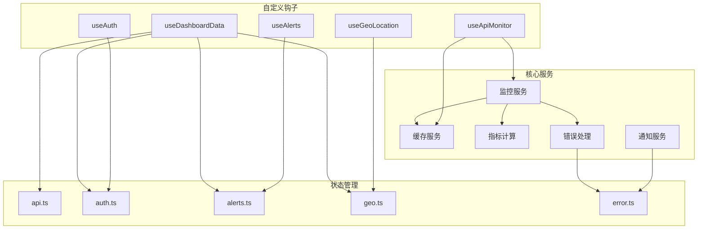
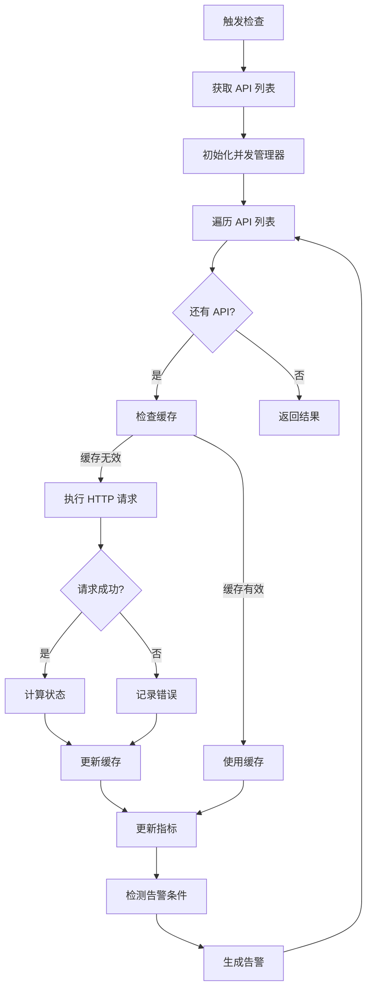
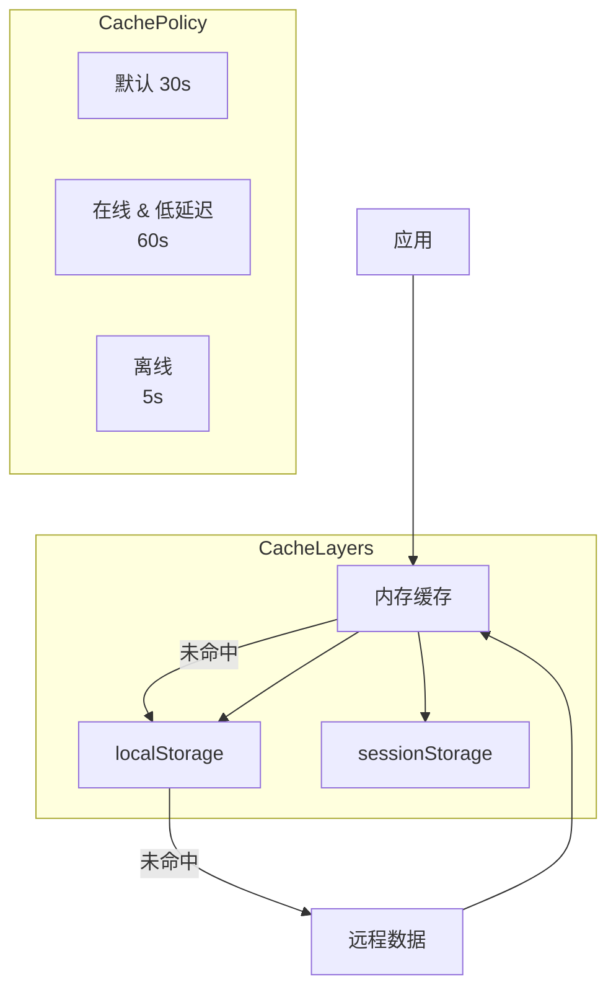
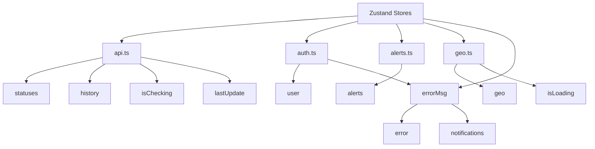

# 逻辑与服务文档

## 1. 核心服务架构

LLM API Sentinel 的核心逻辑由多个服务和钩子组成，负责处理监控、数据管理、认证等功能。



## 2. 监控服务

### 2.1 核心监控流程



### 2.2 并发控制

**并发管理器** (`app/lib/concurrency.ts`) 负责控制同时进行的 API 检查数量，避免请求过多被限流。采用 `ConcurrencyManager` 类实现，支持优先级队列、超时控制和自动重试。

```typescript
// 并发管理器类
export class ConcurrencyManager<T> {
  private queue: QueueItem<T>[] = [];
  private activeRequests: number = 0;
  private concurrencyLimit: number;
  private networkQuality: NetworkQuality = 'good';

  add(fn: () => Promise<T>, options: RequestOptions = {}): Promise<T>;
  getQueueLength(): number;
  getActiveRequests(): number;
  getConcurrencyLimit(): number;
  getNetworkQuality(): NetworkQuality;
}

// 全局并发管理器实例
export const concurrencyManager = new ConcurrencyManager<unknown>();

// 批量处理函数
export async function processBatch<T, R>(
  items: T[],
  processor: (item: T) => Promise<R>,
  options: RequestOptions = {}
): Promise<R[]>
```

**配置参数**：
| 参数 | 默认值 | 说明 |
|-----|-------|------|
| `priority` | 'medium' | 优先级 (high/medium/low) |
| `timeout` | 30000 | 超时时间(ms) |
| `retries` | 0 | 重试次数 |
| `retryDelay` | 1000 | 重试延迟(ms) |

**网络质量动态调整**：
| 网络质量 | 并发限制 | 条件 |
|---------|---------|------|
| excellent | 8 | downlink >= 10Mbps, rtt < 50ms |
| good | 5 (默认) | downlink >= 5Mbps, rtt < 100ms |
| fair | 2 | downlink >= 2Mbps, rtt < 200ms |
| poor | 1 | 其他情况 |

### 2.3 单个 API 检查

**检查流程**：
```typescript
async function checkApi(api: typeof APIS_TO_CHECK[0], retries: number = 0): Promise<ApiCheckResult> {
  // 1. 检查缓存
  const cachedResult = getCache(api.id);
  if (cachedResult) return cachedResult;

  // 2. 执行请求
  const start = Date.now();
  try {
    const controller = new AbortController();
    const timeoutId = setTimeout(() => controller.abort(), 6000);

    const response = await fetch(api.url, {
      method: 'GET',
      signal: controller.signal,
      headers: { 'Content-Type': 'application/json' },
    });
    
    clearTimeout(timeoutId);
    const latency = Date.now() - start;
    const isOnline = response.status < 500;
    
    // 3. 重试逻辑（仅离线时重试）
    if (!isOnline && retries < MAX_RETRIES) {
      await new Promise(resolve => setTimeout(resolve, RETRY_DELAY));
      return checkApi(api, retries + 1);
    }
    
    // 4. 计算真实指标和状态
    const realMetrics = calculateRealMetrics(api.id, latency, isOnline);
    const status = determineStatus(isOnline, latency);
    
    // 5. 返回结果并设置缓存
    const result: ApiCheckResult = {
      ...api,
      status,
      latency,
      lastChecked: new Date().toISOString(),
      retries,
      errorRate: realMetrics.errorRate,
      availability: realMetrics.availability,
      uptime: realMetrics.uptime,
      averageLatency: realMetrics.averageLatency,
      maxLatency: realMetrics.maxLatency,
      minLatency: realMetrics.minLatency
    };

    setCache(api.id, result);
    return result;
  } catch (error) {
    // 错误处理 - 失败重试
    if (retries < MAX_RETRIES) {
      await new Promise(resolve => setTimeout(resolve, RETRY_DELAY));
      return checkApi(api, retries + 1);
    }
    
    const realMetrics = calculateRealMetrics(api.id, 0, false);
    
    const result: ApiCheckResult = {
      ...api,
      status: 'offline',
      latency: 0,
      lastChecked: new Date().toISOString(),
      // 安全清理：避免将潜在的敏感信息存入缓存
      error: error instanceof Error ? sanitizeErrorMessage(error.message) : 'Request failed',
      retries,
      errorRate: realMetrics.errorRate,
      availability: realMetrics.availability,
      uptime: realMetrics.uptime,
      averageLatency: realMetrics.averageLatency,
      maxLatency: realMetrics.maxLatency,
      minLatency: realMetrics.minLatency
    };

    setCache(api.id, result);
    return result;
  }
}
```

**关键函数说明**：
- `sanitizeErrorMessage()`: 安全清理错误消息，防止 URL、Token 等敏感信息泄露到缓存
- `calculateRealMetrics()`: 基于历史数据计算真实的错误率、可用性、平均延迟等指标
- `determineStatus()`: 根据在线状态和延迟判断最终状态（online/offline/degraded）
- `DEGRADED_THRESHOLD`: 降级阈值（1000ms），超过此延迟但在线的 API 标记为 degraded

## 3. 缓存服务

### 3.1 多层缓存架构



### 3.2 缓存操作

```typescript
// 缓存版本控制 - 应用更新时自动清除旧缓存
const CACHE_VERSION = 'v1';
const CACHE_KEY = `apiCheckCache_${CACHE_VERSION}_data`;

// 获取缓存 - 性能优化：只在初始化时加载 storage，后续只读内存缓存
export function getCache(apiId: string): ApiCheckResult | null {
  // 首先检查内存缓存
  const cached = memoryCache[apiId];
  if (cached && isCacheValid(cached)) {
    return cached.result;
  }
  
  // 内存缓存无效，标记需要刷新
  if (!storageLoaded) {
    const storageCache = loadCacheFromStorage();
    memoryCache = { ...memoryCache, ...storageCache };
    storageLoaded = true;
    
    // 再次检查
    const refreshed = memoryCache[apiId];
    if (refreshed && isCacheValid(refreshed)) {
      return refreshed.result;
    }
  }
  
  return null;
}

// 设置缓存
export function setCache(apiId: string, result: ApiCheckResult): void {
  const expiry = calculateCacheExpiry(apiId, result.status, result.latency);
  
  memoryCache[apiId] = {
    result,
    timestamp: Date.now(),
    expiry
  };
  
  saveCacheToStorage(memoryCache);
}

// 初始化缓存
export function initializeCache(): void {
  memoryCache = loadCacheFromStorage();
}

// 清除缓存
export function clearCache(): void;
export function clearApiCache(apiId: string): void;

// 预热缓存
export function prewarmCache(apiIds: string[]): void;
```

**缓存特性**：
- **版本控制**：缓存带版本号，应用更新时自动清除旧版本缓存
- **类型验证**：从存储加载缓存时进行严格的类型验证，防止损坏数据
- **分层加载**：内存缓存优先，localStorage 作为持久层，sessionStorage 作为备用
- **智能保存**：只将过期时间较长的缓存保存到 localStorage，减少存储操作

### 3.3 智能缓存过期策略

| 条件 | 过期时间 | 说明 |
|-----|---------|------|
| online + latency < 100ms | 60 秒 | 快速响应，延长缓存 |
| online + latency 100-1000ms | 30 秒 | 默认缓存时间 |
| online + latency > 1000ms | 15 秒 | 高延迟，缩短缓存 |
| degraded | 15 秒 | 降级状态 |
| offline | 5 秒 | 离线状态，快速重试 |

## 4. 指标计算服务

### 4.1 指标类型

| 指标 | 计算方式 | 说明 |
|-----|---------|------|
| **errorRate** | 失败检查数 / 总检查数 | 错误率百分比 |
| **availability** | 成功检查数 / 总检查数 | 可用性百分比 |
| **uptime** | 与 availability 相同 | 正常运行时间百分比 |
| **averageLatency** | 总延迟 / 成功请求次数 | 平均延迟（仅计算成功请求） |
| **maxLatency** | 历史最大延迟值 | 最大延迟 |
| **minLatency** | 历史最小延迟值 | 最小延迟 |

### 4.2 指标计算逻辑

指标计算使用内存中的滑动窗口（最多 1000 条记录），无需查询数据库：

```typescript
interface HistoricalMetrics {
  totalChecks: number;
  failedChecks: number;
  totalLatency: number;
  maxLatency: number;
  minLatency: number;
}

const metricsCache: Map<string, HistoricalMetrics> = new Map();

function calculateRealMetrics(
  apiId: string,
  currentLatency: number,
  isOnline: boolean,
  totalChecks: number = 100
): { 
  errorRate: number; 
  availability: number; 
  uptime: number; 
  averageLatency: number; 
  maxLatency: number; 
  minLatency: number 
} {
  const existingMetrics = metricsCache.get(apiId);
  
  if (!existingMetrics) {
    // 初始化指标
    const initialMetrics: HistoricalMetrics = {
      totalChecks: totalChecks,
      failedChecks: isOnline ? 0 : 1,
      totalLatency: isOnline ? currentLatency : 0,
      maxLatency: isOnline ? currentLatency : 0,
      minLatency: isOnline ? currentLatency : Number.MAX_SAFE_INTEGER
    };
    metricsCache.set(apiId, initialMetrics);
    return calculateFromMetrics(initialMetrics, currentLatency);
  }
  
  // 更新指标（滑动窗口，最多保留 1000 条记录的统计）
  const updatedMetrics: HistoricalMetrics = {
    totalChecks: Math.min(existingMetrics.totalChecks + 1, 1000),
    failedChecks: isOnline ? existingMetrics.failedChecks : existingMetrics.failedChecks + 1,
    totalLatency: isOnline ? existingMetrics.totalLatency + currentLatency : existingMetrics.totalLatency,
    maxLatency: isOnline ? Math.max(existingMetrics.maxLatency, currentLatency) : existingMetrics.maxLatency,
    minLatency: isOnline ? Math.min(existingMetrics.minLatency, currentLatency) : existingMetrics.minLatency
  };
  
  metricsCache.set(apiId, updatedMetrics);
  return calculateFromMetrics(updatedMetrics, currentLatency);
}
```

**计算特点**：
- 滑动窗口：最多保留 1000 次检查的统计数据
- 增量计算：每次检查后更新指标，无需全量重算
- 仅成功请求计入平均延迟：失败请求不影响延迟统计
- 内存缓存：指标存储在内存中，服务重启后重新累积

## 5. 错误处理服务

### 5.1 错误分类

| 错误类型 | 代码 | 说明 |
|---------|------|------|
| **网络错误** | `NETWORK_TIMEOUT` | 请求超时 |
| **网络错误** | `NETWORK_OFFLINE` | 网络离线 |
| **网络错误** | `NETWORK_ERROR` | 其他网络错误 |
| **API 错误** | `API_UNAVAILABLE` | API 不可用 |
| **API 错误** | `API_ERROR` | API 返回错误 |
| **API 错误** | `API_RATE_LIMITED` | API 限流 |
| **认证错误** | `AUTH_REQUIRED` | 需要认证 |
| **认证错误** | `AUTH_FAILED` | 认证失败 |
| **认证错误** | `AUTH_EXPIRED` | 认证过期 |
| **Supabase 错误** | `SUPABASE_ERROR` | Supabase 通用错误 |
| **Supabase 错误** | `SUPABASE_QUERY_ERROR` | Supabase 查询错误 |
| **验证错误** | `VALIDATION_ERROR` | 数据验证失败 |
| **未知错误** | `UNKNOWN_ERROR` | 其他未知错误 |

### 5.2 错误处理核心函数

```typescript
// app/lib/error-handler.ts

// 错误码枚举
export enum ErrorCode {
  NETWORK_TIMEOUT = 'NETWORK_TIMEOUT',
  NETWORK_OFFLINE = 'NETWORK_OFFLINE',
  NETWORK_ERROR = 'NETWORK_ERROR',
  API_UNAVAILABLE = 'API_UNAVAILABLE',
  API_ERROR = 'API_ERROR',
  API_RATE_LIMITED = 'API_RATE_LIMITED',
  AUTH_REQUIRED = 'AUTH_REQUIRED',
  AUTH_FAILED = 'AUTH_FAILED',
  AUTH_EXPIRED = 'AUTH_EXPIRED',
  SUPABASE_ERROR = 'SUPABASE_ERROR',
  SUPABASE_QUERY_ERROR = 'SUPABASE_QUERY_ERROR',
  VALIDATION_ERROR = 'VALIDATION_ERROR',
  UNKNOWN_ERROR = 'UNKNOWN_ERROR',
}

// 创建标准化错误
export function createError(
  code: ErrorCode,
  message?: string,
  details?: unknown
): AppError;

// 处理未知错误并分类
export function handleError(error: unknown): AppError;

// 记录错误日志
export function logError(error: unknown, context: string): void;
```

### 5.3 错误日志策略

**开发环境**：
- 完整错误对象输出到控制台
- 包含错误堆栈信息
- 带上下文前缀标记

**生产环境**：
- 结构化 JSON 日志
- 脱敏处理：截断过长消息，移除敏感数据
- 不输出堆栈信息
- 仅记录错误码和上下文

### 5.4 通知服务

通知系统通过 Zustand store 管理，支持多种通知类型：

```typescript
// app/store/error.ts
interface Notification {
  id: string;
  type: 'success' | 'error' | 'warning' | 'info';
  message: string;
  timestamp: number;
  duration?: number;      // 默认 5000ms
  dismissible?: boolean;   // 默认 true
}

// Store 方法
addNotification(notification: Omit<Notification, 'id' | 'timestamp'>): void;
removeNotification(id: string): void;
clearNotifications(): void;
showError(error: AppError): void;
showSuccess(message: string): void;
showWarning(message: string): void;
showInfo(message: string): void;
```

**通知特性**：
- 最多同时显示 5 个通知
- 自动过期移除（不同类型时长不同）
- 支持手动关闭
- 按时间倒序排列

## 6. 自定义 Hooks

### 6.1 useDashboardData

**功能**：组合式钩子，统一获取仪表盘所需的所有数据，内部聚合多个专注的单一职责钩子

```typescript
export function useDashboardData() {
  // 使用专注的钩子
  const { geo, isLoading: isGeoLoading, refreshGeo } = useGeoLocation();
  const { statuses, history, isChecking, runCheck } = useApiMonitor();
  const { alerts, resolveAlert } = useAlerts();
  const { user, login, logout } = useAuth();

  const { lastUpdate } = useApiStore();

  return {
    statuses,
    history,
    alerts,
    user,
    isChecking,
    lastUpdate,
    geo,
    isGeoLoading,
    refreshGeo,
    runCheck,
    resolveAlert,
    login,
    logout
  };
}
```

**设计原则**：
- 单一职责：每个子钩子只负责一个领域的数据
- 组合模式：useDashboardData 作为组合层，不包含业务逻辑
- 关注点分离：数据获取、状态管理、UI 渲染各自独立

### 6.2 useApiMonitor

**功能**：管理 API 监控逻辑，支持本地检查 + Supabase 同步，包含智能告警生成

```typescript
export function useApiMonitor() {
  // 从 Zustand store 获取状态
  const { statuses, history, isChecking, setIsChecking, setLastUpdate, setStatuses, addHistoryEntry } = useApiStore();

  // 同步 API 状态到 Supabase（空闲时执行）
  const syncToSupabase = useCallback(async (results: ApiStatus[]) => { ... }, []);

  // 智能告警检查
  const checkAndCreateAlert = useCallback(async (result: ApiStatus) => {
    // 检查是否已有未解决的同类告警
    // 根据状态创建 downtime 或 latency 告警
    // 延迟告警根据严重程度分级：low/medium/high
  }, []);

  // 主检查函数
  const runCheck = useCallback(async () => {
    setIsChecking(true);
    try {
      const results = await performCheck();
      
      // 性能优化: startTransition 标记非紧急更新
      startTransition(() => {
        setStatuses(results.sort((a, b) => a.name.localeCompare(b.name)));
        setLastUpdate(new Date());
      });

      // 添加历史记录
      addHistoryEntry(historyEntries);

      // 并行执行告警检查
      Promise.all(results.map(result => checkAndCreateAlert(result)));

      // 空闲时同步到 Supabase
      requestIdleCallback(() => syncToSupabase(results));
    } finally {
      setIsChecking(false);
    }
  }, [...]);

  // 初始化：从 Supabase 加载，失败则用模拟数据
  useEffect(() => { ... }, []);

  return { statuses, history, isChecking, runCheck };
}
```

**关键特性**：
- 本地优先：先在本地执行检查，异步同步到 Supabase
- 智能告警：自动检测异常并创建告警，避免重复
- 性能优化：startTransition + requestIdleCallback 确保 UI 流畅
- 降级策略：Supabase 不可用时使用模拟数据

### 6.3 useAuth

**功能**：管理 Supabase Auth 认证状态，支持 Google OAuth

```typescript
export function useAuth() {
  const { user, setUser, setError } = useAuthStore();

  useEffect(() => {
    // 获取初始会话
    const getInitialSession = async () => { ... };
    getInitialSession();

    // 监听认证状态变化
    const { data: { subscription } } = supabase.auth.onAuthStateChange(...);

    return () => subscription.unsubscribe();
  }, [setUser]);

  const login = async () => {
    await supabase.auth.signInWithOAuth({
      provider: 'google',
      options: { redirectTo: `${window.location.origin}/auth/callback` }
    });
  };

  const logout = async () => {
    await supabase.auth.signOut();
  };

  return { user, login, logout };
}
```

### 6.4 useAlerts

**功能**：管理告警状态，支持实时同步和解决操作

```typescript
export function useAlerts() {
  const { alerts, setAlerts } = useAlertStore();

  useEffect(() => {
    // 初始加载：获取最近10条未解决告警
    const loadAlerts = async () => { ... };
    loadAlerts();

    // 订阅实时更新（任何变更都重新加载）
    const channel = supabase
      .channel('alerts_changes')
      .on('postgres_changes', { event: '*', table: 'alerts' }, () => loadAlerts())
      .subscribe();

    return () => supabase.removeChannel(channel);
  }, [setAlerts, setError]);

  const resolveAlert = async (id: string) => {
    await supabase.from('alerts').update({
      resolved: true,
      resolved_at: new Date().toISOString()
    }).eq('id', id);
  };

  return { alerts, resolveAlert };
}
```

### 6.5 useGeoLocation

**功能**：基于 IP 获取地理位置信息（使用 ipapi.co 服务），支持用户授权机制

```typescript
export function useGeoLocation() {
  const { geo, isLoading, setGeo, setIsLoading } = useGeoStore();
  const [optInGranted, setOptInGrantedState] = useState(false);
  const [optInRequested, setOptInRequested] = useState(false);

  // 用户授权管理
  const setOptInGranted = useCallback((value: boolean) => { ... }, []);

  // 获取地理位置
  const fetchGeoLocation = useCallback(async (forceRefresh: boolean = false) => {
    // 先检查本地缓存（24小时有效期）
    // 未授权或缓存失效时从 ipapi.co 获取
    // Schema 校验返回数据
    // 失败时使用降级数据
  }, [...]);

  const refreshGeo = useCallback(() => {
    if (hasOptIn()) fetchGeoLocation(true);
  }, [fetchGeoLocation]);

  return {
    geo: geo ?? FALLBACK_GEO,
    isLoading,
    optInGranted,
    optInRequested,
    setOptInGranted,
    refreshGeo,
  };
}
```

**隐私设计**：
- 明确的 opt-in 机制：用户必须明确同意才能获取地理位置
- 本地缓存 24 小时，减少 API 调用
- 数据仅保存在本地，不上传服务器
- 支持随时撤销授权并清除数据

## 7. 状态管理

### 7.1 Zustand Store 结构



**Store 持久化策略**：
| Store | 持久化方式 | 持久化字段 |
|-------|-----------|-----------|
| api.ts | zustand/persist (localStorage) | statuses |
| auth.ts | 无（从 Supabase 同步） | - |
| alerts.ts | 无（从 Supabase 同步） | - |
| geo.ts | localStorage | geo 信息（24小时过期） |
| error.ts | 无 | - |

### 7.2 api.ts Store 实现

```typescript
export interface ApiStoreState {
  // 状态数据
  statuses: ApiStatus[];
  history: StatusHistory[];
  isChecking: boolean;
  lastUpdate: Date | null;
  
  // 状态更新方法
  setStatuses: (statuses: ApiStatus[]) => void;
  setHistory: (history: StatusHistory[]) => void;
  setIsChecking: (isChecking: boolean) => void;
  setLastUpdate: (lastUpdate: Date | null) => void;
  
  // 操作方法
  clearHistory: () => void;
  addHistoryEntry: (entry: StatusHistory | StatusHistory[]) => void;
  updateApiStatus: (apiId: string, status: Partial<ApiStatus>) => void;
  clearApiStatuses: () => void;
}

// 历史记录只保留最近 100 条
addHistoryEntry: (entryOrEntries) => set((state) => {
  const entries = Array.isArray(entryOrEntries) ? entryOrEntries : [entryOrEntries];
  return {
    history: [...state.history, ...entries].slice(-100)
  };
}),
```

## 8. 后台监控任务

### 8.1 任务调度

后台监控任务在 Express 服务器 (examples/self-host-server.ts) 中运行，使用 setInterval 定时执行：

```typescript
// examples/self-host-server.ts
// 后台任务：每 5 分钟执行一次
setInterval(runBackgroundMonitor, 5 * 60 * 1000);
// 首次检查：服务器启动后延迟 10 秒执行
setTimeout(runBackgroundMonitor, 10000);
```

**调度配置**：
| 配置项 | 值 | 说明 |
|-------|---|------|
| 检查间隔 | 5 分钟 | 后台自动检查频率 |
| 首次延迟 | 10 秒 | 服务器启动后首次检查的延迟时间 |

### 8.2 后台监控流程

```typescript
async function runBackgroundMonitor() {
  const results = await performCheck();

  // 1. Upsert API 状态
  const upsertData = results.map(result => ({
    id: result.id,
    name: result.name,
    provider: result.provider,
    url: result.url,
    status: result.status,
    latency: result.latency,
    last_checked: result.lastChecked,
    error: result.error || null,
    retries: result.retries || 0,
    error_rate: result.errorRate || 0,
    availability: result.availability || 100,
    uptime: result.uptime || 100,
    average_latency: result.averageLatency || null,
    max_latency: result.maxLatency || null,
    min_latency: result.minLatency || null,
    updated_at: new Date().toISOString(),
  }));

  await supabase.from('api_status').upsert(upsertData, { onConflict: 'id' });

  // 2. 插入历史记录
  const historyData = results.map(result => ({
    api_id: result.id,
    status: result.status,
    latency: result.latency,
    error: result.error || null,
    retries: result.retries || 0,
    timestamp: new Date().toISOString(),
  }));

  await supabase.from('status_history').insert(historyData);

  // 3. 智能告警检测
  for (const result of results) {
    // 检查是否已有同类未解决告警
    const hasExisting = await hasExistingAlert(result.id, result.status === 'offline' ? 'downtime' : 'latency');
    
    if (!hasExisting) {
      if (result.status === 'offline') {
        // 创建 downtime 告警
        await supabase.from('alerts').insert({ ... });
      } else if (result.latency > LATENCY_THRESHOLD) {
        // 创建 latency 告警
        await supabase.from('alerts').insert({ ... });
      }
    }
  }
}
```

**服务端告警特性**：
- 使用 service_role 密钥写入（绕过 RLS）
- 去重检查：同一 API 的同一类型未解决告警不会重复创建
- 自动标记：自动检测的告警消息带有 "(Auto-detected)" 标识

## 9. 工具函数

### 9.1 时间格式化

```typescript
import { format, formatDistanceToNow } from 'date-fns';

export function formatTime(date: Date | string): string {
  const dateObj = typeof date === 'string' ? new Date(date) : date;
  return format(dateObj, 'HH:mm:ss');
}

export function formatRelativeTime(date: Date | string): string {
  const dateObj = typeof date === 'string' ? new Date(date) : date;
  return formatDistanceToNow(dateObj, { addSuffix: true });
}
```

### 10.2 状态颜色映射

```typescript
export function getStatusColor(status: ApiStatus['status']): string {
  switch (status) {
    case 'online': return '#10B981';
    case 'offline': return '#EF4444';
    case 'degraded': return '#F59E0B';
    default: return '#6B7280';
  }
}

export function getStatusText(status: ApiStatus['status']): string {
  switch (status) {
    case 'online': return 'Online';
    case 'offline': return 'Offline';
    case 'degraded': return 'Degraded';
    default: return 'Unknown';
  }
}
```

### 10.3 延迟等级判断

```typescript
export function getLatencyLevel(latency: number): 'fast' | 'normal' | 'slow' | 'critical' {
  if (latency < 500) return 'fast';
  if (latency < 1000) return 'normal';
  if (latency < 1500) return 'slow';
  return 'critical';
}

export function getLatencyColor(latency: number): string {
  switch (getLatencyLevel(latency)) {
    case 'fast': return '#10B981';
    case 'normal': return '#3B82F6';
    case 'slow': return '#F59E0B';
    case 'critical': return '#EF4444';
  }
}
```