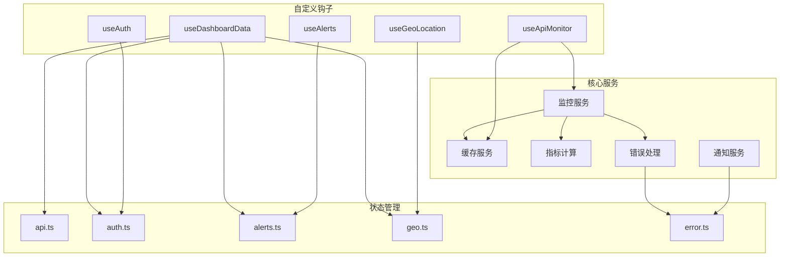
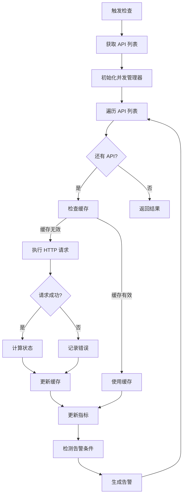
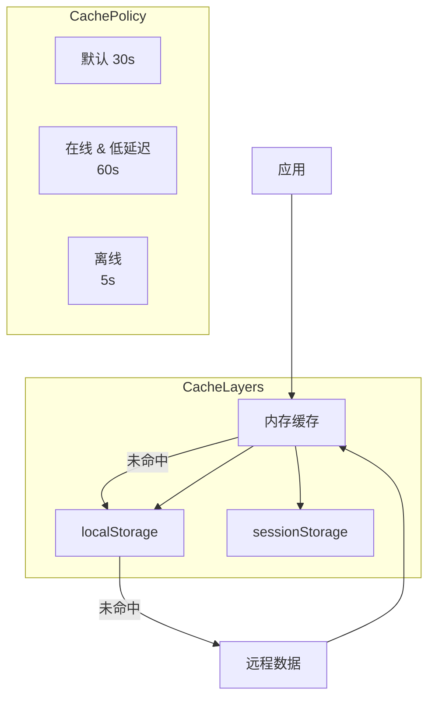
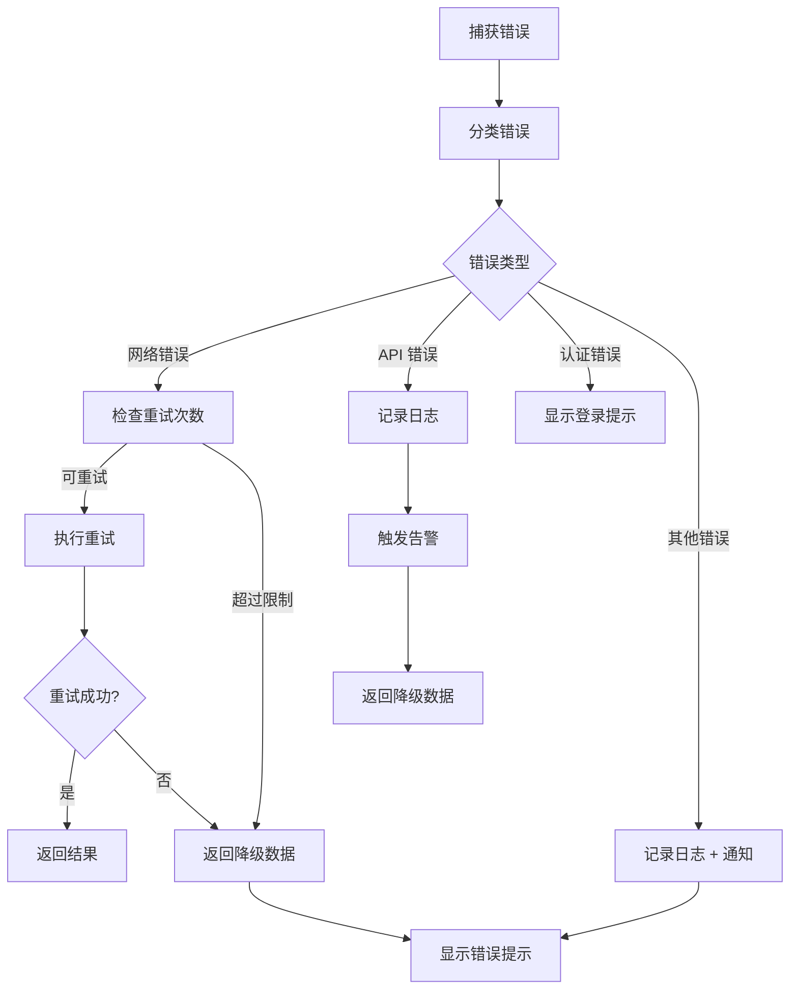
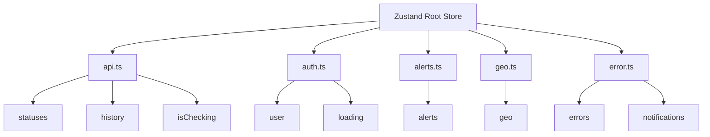

# 逻辑与服务文档

## 1. 核心服务架构

LLM API Sentinel 的核心逻辑由多个服务和钩子组成，负责处理监控、数据管理、认证等功能。



## 2. 监控服务

### 2.1 核心监控流程



### 2.2 并发控制

**并发管理器** (`app/lib/concurrency.ts`) 负责控制同时进行的 API 检查数量，避免请求过多被限流。

```typescript
export async function processBatch<T, R>(
  items: T[],
  processor: (item: T) => Promise<R>,
  options: {
    priority?: 'low' | 'medium' | 'high';
    timeout?: number;
    retries?: number;
    retryDelay?: number;
  }
): Promise<R[]> {
  // 并发控制逻辑
}
```

**配置参数**：
| 参数 | 默认值 | 说明 |
|-----|-------|------|
| `priority` | 'medium' | 优先级 |
| `timeout` | 30000 | 超时时间(ms) |
| `retries` | 1 | 重试次数 |
| `retryDelay` | 1000 | 重试延迟(ms) |

### 2.3 单个 API 检查

**检查流程**：
```typescript
async function checkApi(api: ApiConfig, retries: number = 0): Promise<ApiStatus> {
  // 1. 检查缓存
  const cached = getCache(api.id);
  if (cached) return cached;
  
  // 2. 执行请求
  const start = Date.now();
  try {
    const controller = new AbortController();
    const timeoutId = setTimeout(() => controller.abort(), 6000);
    
    const response = await fetch(api.url, {
      method: 'GET',
      signal: controller.signal,
      headers: { 'Content-Type': 'application/json' },
    });
    
    clearTimeout(timeoutId);
    const latency = Date.now() - start;
    
    // 3. 判断状态
    const isOnline = response.status < 500;
    
    // 4. 重试逻辑
    if (!isOnline && retries < MAX_RETRIES) {
      await delay(RETRY_DELAY);
      return checkApi(api, retries + 1);
    }
    
    // 5. 返回结果
    return {
      ...api,
      status: isOnline ? 'online' : 'offline',
      latency,
      lastChecked: new Date().toISOString(),
      retries,
    };
  } catch (error) {
    // 错误处理
    if (retries < MAX_RETRIES) {
      await delay(RETRY_DELAY);
      return checkApi(api, retries + 1);
    }
    
    return {
      ...api,
      status: 'offline',
      latency: 0,
      lastChecked: new Date().toISOString(),
      error: error instanceof Error ? error.message : String(error),
      retries,
    };
  }
}
```

## 3. 缓存服务

### 3.1 多层缓存架构



### 3.2 缓存操作

```typescript
// 获取缓存
export function getCache(apiId: string): ApiStatus | null {
  const cached = memoryCache[apiId];
  if (cached && isCacheValid(cached)) {
    return cached.result;
  }
  return null;
}

// 设置缓存
export function setCache(apiId: string, result: ApiStatus): void {
  const expiry = calculateCacheExpiry(apiId, result.status, result.latency);
  memoryCache[apiId] = { result, timestamp: Date.now(), expiry };
  saveCacheToStorage(memoryCache);
}

// 初始化缓存
export function initializeCache(): void {
  memoryCache = loadCacheFromStorage();
}
```

### 3.3 智能缓存过期策略

| 条件 | 过期时间 | 说明 |
|-----|---------|------|
| online + latency < 100ms | 60 秒 | 快速响应，延长缓存 |
| online + latency 100-1000ms | 30 秒 | 默认缓存时间 |
| online + latency > 1000ms | 15 秒 | 高延迟，缩短缓存 |
| degraded | 15 秒 | 降级状态 |
| offline | 5 秒 | 离线状态，快速重试 |

## 4. 指标计算服务

### 4.1 指标类型

| 指标 | 计算方式 | 说明 |
|-----|---------|------|
| **errorRate** | 错误请求数 / 总请求数 | 错误率百分比 |
| **availability** | 可用时间 / 总时间 | 可用性百分比 |
| **uptime** | 正常运行时间 / 总时间 | 正常运行时间百分比 |
| **averageLatency** | 总延迟 / 请求次数 | 平均延迟 |
| **maxLatency** | 最大延迟值 | 最大延迟 |
| **minLatency** | 最小延迟值 | 最小延迟 |

### 4.2 指标计算逻辑

```typescript
export async function calculateMetrics(apiId: string): Promise<Metrics> {
  // 从历史数据计算指标
  const history = await getHistoryData(apiId);
  
  const totalRequests = history.length;
  const successfulRequests = history.filter(h => h.status === 'online').length;
  const latencies = history.map(h => h.latency);
  
  return {
    errorRate: totalRequests > 0 ? ((totalRequests - successfulRequests) / totalRequests) * 100 : 0,
    availability: totalRequests > 0 ? (successfulRequests / totalRequests) * 100 : 100,
    uptime: 100, // 需要更复杂的计算
    averageLatency: latencies.length > 0 
      ? latencies.reduce((a, b) => a + b, 0) / latencies.length 
      : 0,
    maxLatency: latencies.length > 0 ? Math.max(...latencies) : 0,
    minLatency: latencies.length > 0 ? Math.min(...latencies) : 0,
  };
}
```

## 5. 错误处理服务

### 5.1 错误分类

| 错误类型 | 代码 | 处理方式 |
|---------|------|---------|
| **网络错误** | `NETWORK_TIMEOUT` | 重试 + 降级显示 |
| **网络错误** | `NETWORK_OFFLINE` | 显示离线提示 |
| **API 错误** | `API_UNAVAILABLE` | 记录日志 + 告警 |
| **API 错误** | `API_RATE_LIMITED` | 延迟重试 |
| **认证错误** | `AUTH_REQUIRED` | 显示登录提示 |
| **Firebase 错误** | `FIREBASE_ERROR` | 重试 + 错误日志 |
| **未知错误** | `UNKNOWN_ERROR` | 记录 + 通知 |

### 5.2 错误处理流程



### 5.3 错误边界

```typescript
// ErrorBoundary 组件
class ErrorBoundary extends React.Component {
  state = { hasError: false, error: null };
  
  static getDerivedStateFromError(error) {
    return { hasError: true, error };
  }
  
  componentDidCatch(error, errorInfo) {
    logError(error, errorInfo);
  }
  
  render() {
    if (this.state.hasError) {
      return (
        <div className="error-fallback">
          <h2>Something went wrong</h2>
          <p>{this.state.error?.message}</p>
          <button onClick={() => this.setState({ hasError: false, error: null })}>
            Try again
          </button>
        </div>
      );
    }
    
    return this.props.children;
  }
}
```

## 6. 通知服务

### 6.1 通知类型

| 类型 | 触发条件 | 显示方式 |
|-----|---------|---------|
| **告警通知** | 新告警创建 | 横幅 + 铃铛 |
| **错误通知** | 操作失败 | Toast |
| **成功通知** | 操作成功 | Toast |
| **信息通知** | 状态变更 | Toast |

### 6.2 通知管理

```typescript
// 显示通知
export function showNotification(message: string, type: NotificationType = 'info') {
  const notification = {
    id: Date.now().toString(),
    message,
    type,
    timestamp: new Date(),
  };
  
  // 添加到状态
  addNotification(notification);
  
  // 自动移除
  setTimeout(() => {
    removeNotification(notification.id);
  }, 5000);
}

// 发送告警通知
export async function sendAlertNotification(alert: Alert) {
  // 显示 UI 通知
  showNotification(alert.message, 'error');
  
  // 可选：发送邮件/短信通知
  if (alert.severity === 'critical' || alert.severity === 'high') {
    await sendEmailNotification(alert);
  }
}
```

## 7. 自定义 Hooks

### 7.1 useDashboardData

**功能**：统一获取仪表盘所需的所有数据

```typescript
export function useDashboardData() {
  const [statuses, setStatuses] = useState<ApiStatus[]>([]);
  const [history, setHistory] = useState<StatusHistory[]>([]);
  const [alerts, setAlerts] = useState<Alert[]>([]);
  const [user, setUser] = useState<User | null>(null);
  const [isChecking, setIsChecking] = useState(false);
  const [lastUpdate, setLastUpdate] = useState<Date | null>(null);
  const [geo, setGeo] = useState<GeoInfo | null>(null);

  // 从 Firestore 实时获取数据
  useEffect(() => {
    const unsubscribe = firestore.collection('api_status')
      .onSnapshot((snapshot) => {
        const data = snapshot.docs.map(doc => doc.data() as ApiStatus);
        setStatuses(data);
        setLastUpdate(new Date());
      });

    return () => unsubscribe();
  }, []);

  // 获取用户认证状态
  useEffect(() => {
    const unsubscribe = auth.onAuthStateChanged(setUser);
    return () => unsubscribe();
  }, []);

  // 获取地理位置
  useEffect(() => {
    getGeoLocation().then(setGeo);
  }, []);

  // 执行检查
  const runCheck = async () => {
    if (!user) {
      showNotification('Please login to run manual check', 'error');
      return;
    }
    
    setIsChecking(true);
    try {
      const results = await performCheck();
      await updateStatuses(results);
    } finally {
      setIsChecking(false);
    }
  };

  // 解决告警
  const resolveAlert = async (id: string) => {
    await firestore.collection('alerts').doc(id).update({
      resolved: true,
      resolvedAt: new Date(),
      resolvedBy: user?.email,
    });
  };

  return {
    statuses,
    history,
    alerts,
    user,
    isChecking,
    lastUpdate,
    geo,
    runCheck,
    resolveAlert,
    login: signInWithGoogle,
    logout: signOut,
  };
}
```

### 7.2 useApiMonitor

**功能**：管理 API 监控逻辑，直接从 Firestore 读取状态

```typescript
export function useApiMonitor() {
  const [statuses, setStatuses] = useState<ApiStatus[]>([]);
  const [history, setHistory] = useState<StatusHistory[]>([]);
  const [isChecking, setIsChecking] = useState(false);

  // 订阅 API 状态
  useEffect(() => {
    const unsubscribe = firestore.collection('api_status')
      .onSnapshot((snapshot) => {
        setStatuses(snapshot.docs.map(doc => doc.data() as ApiStatus));
      });

    return () => unsubscribe();
  }, []);

  // 获取历史数据
  const fetchHistory = async () => {
    const snapshot = await firestore.collection('status_history')
      .orderBy('timestamp', 'desc')
      .limit(50)
      .get();
    
    setHistory(snapshot.docs.map(doc => doc.data() as StatusHistory));
  };

  // 执行检查
  const runCheck = async () => {
    setIsChecking(true);
    try {
      await performCheck();
      await fetchHistory();
    } finally {
      setIsChecking(false);
    }
  };

  return { statuses, history, isChecking, runCheck, fetchHistory };
}
```

### 7.3 useAuth

**功能**：管理 Firebase 认证状态

```typescript
export function useAuth() {
  const [user, setUser] = useState<User | null>(null);
  const [loading, setLoading] = useState(true);

  useEffect(() => {
    const unsubscribe = auth.onAuthStateChanged((user) => {
      setUser(user);
      setLoading(false);
    });

    return () => unsubscribe();
  }, []);

  const login = async () => {
    const provider = new GoogleAuthProvider();
    await signInWithPopup(auth, provider);
  };

  const logout = async () => {
    await signOut(auth);
  };

  return { user, loading, login, logout };
}
```

### 7.4 useAlerts

**功能**：管理告警状态和操作

```typescript
export function useAlerts() {
  const [alerts, setAlerts] = useState<Alert[]>([]);

  useEffect(() => {
    const unsubscribe = firestore.collection('alerts')
      .where('resolved', '==', false)
      .orderBy('timestamp', 'desc')
      .onSnapshot((snapshot) => {
        setAlerts(snapshot.docs.map(doc => ({
          id: doc.id,
          ...doc.data(),
        })));
      });

    return () => unsubscribe();
  }, []);

  const resolveAlert = async (id: string) => {
    await firestore.collection('alerts').doc(id).update({
      resolved: true,
      resolvedAt: new Date(),
    });
  };

  return { alerts, resolveAlert };
}
```

### 7.5 useGeoLocation

**功能**：获取并缓存地理位置信息

```typescript
export function useGeoLocation() {
  const [geo, setGeo] = useState<GeoInfo | null>(null);
  const [loading, setLoading] = useState(true);

  useEffect(() => {
    const cached = getCachedGeoLocation();
    if (cached) {
      setGeo(cached);
      setLoading(false);
      return;
    }

    navigator.geolocation.getCurrentPosition(
      (position) => {
        const geoInfo: GeoInfo = {
          latitude: position.coords.latitude,
          longitude: position.coords.longitude,
          timestamp: Date.now(),
        };
        setGeo(geoInfo);
        cacheGeoLocation(geoInfo);
        setLoading(false);
      },
      () => {
        setLoading(false);
      },
      { timeout: 10000 }
    );
  }, []);

  return { geo, loading };
}
```

## 8. 状态管理

### 8.1 Zustand Store 结构



### 8.2 Store 实现示例

```typescript
// api.ts
export const useApiStore = create((set) => ({
  statuses: [],
  history: [],
  isChecking: false,
  
  setStatuses: (statuses: ApiStatus[]) => set({ statuses }),
  setHistory: (history: StatusHistory[]) => set({ history }),
  setIsChecking: (isChecking: boolean) => set({ isChecking }),
  
  fetchStatuses: async () => {
    set({ isChecking: true });
    const statuses = await fetchApiStatuses();
    set({ statuses, isChecking: false });
  },
}));
```

## 9. 后台监控任务

### 9.1 任务调度

```typescript
// server.ts
const CHECK_INTERVAL = 5 * 60 * 1000; // 5 分钟
const INITIAL_DELAY = 10 * 1000; // 10 秒

async function runBackgroundMonitor() {
  console.log('[Monitor] Starting background check...');
  try {
    const results = await performCheck();
    await updateFirestore(results);
    console.log('[Monitor] Background check completed successfully');
  } catch (error) {
    console.error('[Monitor] Background check failed:', error);
  }
}

// 服务器启动后延迟执行
setTimeout(() => {
  runBackgroundMonitor();
  
  // 定期执行
  setInterval(runBackgroundMonitor, CHECK_INTERVAL);
}, INITIAL_DELAY);
```

### 9.2 批量写入 Firestore

```typescript
async function updateFirestore(results: ApiStatus[]) {
  const batch = db.batch();

  for (const result of results) {
    // 更新当前状态
    const statusRef = db.collection('api_status').doc(result.id);
    batch.set(statusRef, result);

    // 添加历史记录
    const historyRef = db.collection('status_history').doc();
    batch.set(historyRef, {
      apiId: result.id,
      status: result.status,
      latency: result.latency,
      timestamp: FieldValue.serverTimestamp(),
      time: new Date().toLocaleTimeString(),
    });

    // 告警逻辑
    await handleAlerts(result);
  }

  await batch.commit();
}
```

### 9.3 智能告警逻辑

```typescript
async function handleAlerts(result: ApiStatus) {
  // 检查是否已有同类未解决告警
  const existingAlert = await db.collection('alerts')
    .where('apiId', '==', result.id)
    .where('resolved', '==', false)
    .where('type', '==', getAlertType(result))
    .get();

  if (!existingAlert.empty) {
    return; // 已有同类告警，不重复创建
  }

  // 创建新告警
  if (result.status === 'offline') {
    await db.collection('alerts').add({
      apiId: result.id,
      apiName: result.name,
      type: 'downtime',
      severity: 'critical',
      message: `${result.name} is currently offline`,
      timestamp: FieldValue.serverTimestamp(),
      resolved: false,
    });
  } else if (result.latency > LATENCY_THRESHOLD) {
    await db.collection('alerts').add({
      apiId: result.id,
      apiName: result.name,
      type: 'latency',
      severity: calculateSeverity(result.latency),
      message: `${result.name} latency is high: ${result.latency}ms`,
      timestamp: FieldValue.serverTimestamp(),
      resolved: false,
      latency: result.latency,
    });
  }
}
```

## 10. 工具函数

### 10.1 时间格式化

```typescript
import { format, formatDistanceToNow } from 'date-fns';

export function formatTime(date: Date | string): string {
  const dateObj = typeof date === 'string' ? new Date(date) : date;
  return format(dateObj, 'HH:mm:ss');
}

export function formatRelativeTime(date: Date | string): string {
  const dateObj = typeof date === 'string' ? new Date(date) : date;
  return formatDistanceToNow(dateObj, { addSuffix: true });
}
```

### 10.2 状态颜色映射

```typescript
export function getStatusColor(status: ApiStatus['status']): string {
  switch (status) {
    case 'online': return '#10B981';
    case 'offline': return '#EF4444';
    case 'degraded': return '#F59E0B';
    default: return '#6B7280';
  }
}

export function getStatusText(status: ApiStatus['status']): string {
  switch (status) {
    case 'online': return 'Online';
    case 'offline': return 'Offline';
    case 'degraded': return 'Degraded';
    default: return 'Unknown';
  }
}
```

### 10.3 延迟等级判断

```typescript
export function getLatencyLevel(latency: number): 'fast' | 'normal' | 'slow' | 'critical' {
  if (latency < 500) return 'fast';
  if (latency < 1000) return 'normal';
  if (latency < 1500) return 'slow';
  return 'critical';
}

export function getLatencyColor(latency: number): string {
  switch (getLatencyLevel(latency)) {
    case 'fast': return '#10B981';
    case 'normal': return '#3B82F6';
    case 'slow': return '#F59E0B';
    case 'critical': return '#EF4444';
  }
}
```